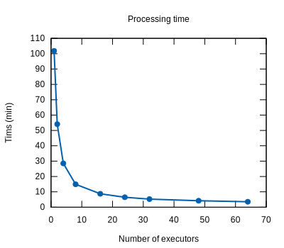
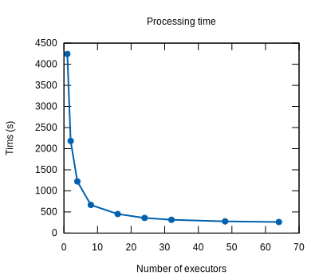
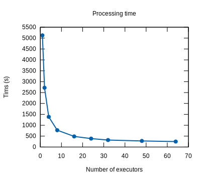

# Cobrix - COBOL Data Source for Apache Spark

[](https://directory.fsf.org/wiki/License:Apache-2.0)
[](https://app.fossa.com/projects/custom%2B24661%2Fgithub.com%2FAbsaOSS%2Fcobrix)
[](https://github.com/AbsaOSS/cobrix/actions)
[](https://maven-badges.herokuapp.com/maven-central/za.co.absa.cobrix/spark-cobol_2.13)

Pain free Spark/Cobol files integration.

Seamlessly query your COBOL/EBCDIC binary files as Spark Dataframes and streams.   

Add mainframe as a source to your data engineering strategy.

## Motivation

Among the motivations for this project, it is possible to highlight:

- Lack of expertise in the Cobol ecosystem, which makes it hard to integrate mainframes into data engineering strategies

- Lack of support from the open-source community to initiatives in this field

- The overwhelming majority (if not all) of tools to cope with this domain are proprietary

- Several institutions struggle daily to maintain their legacy mainframes, which prevents them from evolving to more modern approaches to data management

- Mainframe data can only take part in data science activities through very expensive investments


## Features

- Supports primitive types (although some are "Cobol compiler specific")

- Supports REDEFINES, OCCURS and DEPENDING ON fields (e.g. unchecked unions and variable-size arrays)

- Supports nested structures and arrays

- Supports HDFS as well as local file systems

- The COBOL copybooks parser doesn't have a Spark dependency and can be reused for integrating into other data processing engines

## Videos

We have presented Cobrix at DataWorks Summit 2019 and Spark Summit 2019 conferences. The screencasts are available here:

DataWorks Summit 2019 (General Cobrix workflow for hierarchical databases): https://www.youtube.com/watch?v=o_up7X3ZL24

Spark Summit 2019 (More detailed overview of performance optimizations): https://www.youtube.com/watch?v=BOBIdGf3Tm0

## Requirements

| spark-cobol | Spark   |
|-------------|---------|
| 0.x         | 2.2+    |
| 1.x         | 2.2+    |
| 2.x         | 2.4.3+  |
| 2.6.x+      | 3.2.0+  |

## Linking

You can link against this library in your program at the following coordinates:

<table>
<tr><th>Scala 2.11</th><th>Scala 2.12</th><th>Scala 2.13</th></tr>
<tr>
<td align="center">
<a href = "https://maven-badges.herokuapp.com/maven-central/za.co.absa.cobrix/spark-cobol_2.11"></a><br>
</td>
<td align="center">
<a href = "https://maven-badges.herokuapp.com/maven-central/za.co.absa.cobrix/spark-cobol_2.12"></a><br>
</td>
<td align="center">
<a href = "https://maven-badges.herokuapp.com/maven-central/za.co.absa.cobrix/spark-cobol_2.13"></a><br>
</td>
</tr>
<tr>
<td>
<pre>groupId: za.co.absa.cobrix<br>artifactId: spark-cobol_2.11<br>version: 2.8.0</pre>
</td>
<td>
<pre>groupId: za.co.absa.cobrix<br>artifactId: spark-cobol_2.12<br>version: 2.8.0</pre>
</td>
<td>
<pre>groupId: za.co.absa.cobrix<br>artifactId: spark-cobol_2.13<br>version: 2.8.0</pre>
</td>
</tr>
</table>

## Using with Spark shell
This package can be added to Spark using the `--packages` command line option. For example, to include it when starting the spark shell:


### Spark compiled with Scala 2.11
```
$SPARK_HOME/bin/spark-shell --packages za.co.absa.cobrix:spark-cobol_2.11:2.8.0
```

### Spark compiled with Scala 2.12
```
$SPARK_HOME/bin/spark-shell --packages za.co.absa.cobrix:spark-cobol_2.12:2.8.0
```

### Spark compiled with Scala 2.13
```
$SPARK_HOME/bin/spark-shell --packages za.co.absa.cobrix:spark-cobol_2.13:2.8.0
```

## Usage

## Quick start

This repository contains several standalone example applications in `examples/spark-cobol-app` directory.
It is a Maven project that contains several examples:
* `SparkTypesApp` is an example of a very simple mainframe file processing.
   It is a fixed record length raw data file with a corresponding copybook. The copybook 
   contains examples of various numeric data types Cobrix supports.
* `SparkCobolApp` is an example of a Spark Job for handling multisegment variable record
   length mainframe files.  
* `SparkCodecApp` is an example usage of a custom record header parser. This application reads a variable
   record length file having non-standard RDW headers. In this example RDH header is 5 bytes instead of 4
* `SparkCobolHierarchical` is an example processing of an EBCDIC multisegment file extracted from a hierarchical database.


The example project can be used as a template for creating Spark Application. Refer to README.md
of that project for the detailed guide how to run the examples locally and on a cluster.

When running `mvn clean package` in `examples/spark-cobol-app` an uber jar will be created. It can be used to run
jobs via `spark-submit` or `spark-shell`. 

## How to generate Code coverage report
```sbt
sbt ++{scala_version} jacoco
```
Code coverage will be generated on path:
```
{project-root}/cobrix/{module}/target/scala-{scala_version}/jacoco/report/html
```

### Reading Cobol binary files from HDFS/local and querying them 

1. Create a Spark ```SQLContext```

2. Start a ```sqlContext.read``` operation specifying ```za.co.absa.cobrix.spark.cobol.source``` as the format

3. Inform the path to the copybook describing the files through ```... .option("copybook", "path_to_copybook_file")```. By default the copybook
   is expected to be in HDFS. You can specify that a copybook is located in the local file system by adding `file://` prefix. For example, you
   can specify a local file like this `.option("copybook", "file:///home/user/data/compybook.cpy")`. Alternatively, instead of providing a path
   to a copybook file you can provide the contents of the copybook itself by using `.option("copybook_contents", "...copybook contents...")`. 

4. Inform the path to the HDFS directory containing the files: ```... .load("path_to_directory_containing_the_binary_files")``` 

5. Inform the query you would like to run on the Cobol Dataframe

Below is an example whose full version can be found at ```za.co.absa.cobrix.spark.cobol.examples.SampleApp``` and ```za.co.absa.cobrix.spark.cobol.examples.CobolSparkExample```

```scala
val sparkBuilder = SparkSession.builder().appName("Example")
val spark = sparkBuilder
  .getOrCreate()

val cobolDataframe = spark
  .read
  .format("cobol")
  .option("copybook", "data/test1_copybook.cob")
  .load("data/test2_data")

cobolDataframe
    .filter("RECORD.ID % 2 = 0") // filter the even values of the nested field 'RECORD_LENGTH'
    .take(10)
    .foreach(v => println(v))
```

The full example is available [here](https://github.com/AbsaOSS/cobrix/blob/master/spark-cobol/src/main/scala/za/co/absa/cobrix/spark/cobol/examples/CobolSparkExample.scala)

In some scenarios Spark is unable to find "cobol" data source by it's short name. In that case you can use the full path to the source class instead: `.format("za.co.absa.cobrix.spark.cobol.source")`

Cobrix assumes input data is encoded in EBCDIC. You can load ASCII files as well by specifying the following option:
`.option("encoding", "ascii")`.

If the input file is a text file (CRLF / LF are used to split records), use
`.option("is_text", "true")`.

Multisegment ASCII text files are supported using this option:
`.option("record_format", "D")`.

Cobrix has better handling of special characters and partial records using its extension format:
`.option("record_format", "D2")`.

Read more on record formats at https://www.ibm.com/docs/en/zos/2.4.0?topic=files-selecting-record-formats-non-vsam-data-sets

### Streaming Cobol binary files from a directory

1. Create a Spark ```StreamContext```

2. Import the binary files/stream conversion manager: ```za.co.absa.spark.cobol.source.streaming.CobolStreamer._```

3. Read the binary files contained in the path informed in the creation of the ```SparkSession``` as a stream: ```... streamingContext.cobolStream()```

4. Apply queries on the stream: ```... stream.filter("some_filter") ...```

5. Start the streaming job.

Below is an example whose full version can be found at ```za.co.absa.cobrix.spark.cobol.examples.StreamingExample```

```scala
val spark = SparkSession
  .builder()
  .appName("CobolParser")
  .master("local[2]")
  .config("duration", 2)
  .config("copybook", "path_to_the_copybook")
  .config("path", "path_to_source_directory") // could be both, local or HDFS
  .getOrCreate()          
      
val streamingContext = new StreamingContext(spark.sparkContext, Seconds(3))         
    
import za.co.absa.spark.cobol.source.streaming.CobolStreamer._ // imports the Cobol streams manager

val stream = streamingContext.cobolStream() // streams the binary files into the application    

stream
    .filter(row => row.getAs[Integer]("NUMERIC_FLD") % 2 == 0) // filters the even values of the nested field 'NUMERIC_FLD'
    .print(10)		

streamingContext.start()
streamingContext.awaitTermination()
```

### Using Cobrix from a Spark shell

To query mainframe files interactively using `spark-shell` you need to provide jar(s) containing Corbrix and it's dependencies.
This can be done either by downloading all the dependencies as separate jars or by creating an uber jar that contains all
of the dependencies.

#### Getting all Cobrix dependencies

Cobrix's `spark-cobol` data source depends on the COBOL parser that is a part of Cobrix itself.

The jars that you need to get are:

* spark-cobol_2.12-2.8.0.jar
* cobol-parser_2.12-2.8.0.jar

> Versions older than 2.8.0 also need `scodec-core_2.12-1.10.3.jar` and `scodec-bits_2.12-1.1.4.jar`.

> Versions older than 2.7.1 also need `antlr4-runtime-4.8.jar`.

After that you can specify these jars in `spark-shell` command line. Here is an example:
```
$ spark-shell --packages za.co.absa.cobrix:spark-cobol_2.12:2.8.0
or 
$ spark-shell --master yarn --deploy-mode client --driver-cores 4 --driver-memory 4G --jars spark-cobol_2.12-2.8.0.jar,cobol-parser_2.12-2.8.0.jar

Setting default log level to "WARN".
To adjust logging level use sc.setLogLevel(newLevel). For SparkR, use setLogLevel(newLevel).
Spark context available as 'sc' (master = yarn, app id = application_1535701365011_2721).
Spark session available as 'spark'.
Welcome to
      ____              __
     / __/__  ___ _____/ /__
    _\ \/ _ \/ _ `/ __/  '_/
   /___/ .__/\_,_/_/ /_/\_\   version 2.4.5
      /_/

Using Scala version 2.11.8 (OpenJDK 64-Bit Server VM, Java 1.8.0_171)
Type in expressions to have them evaluated.
Type :help for more information.

scala> val df = spark.read.format("cobol").option("copybook", "/data/example1/test3_copybook.cob").load("/data/example1/data")
df: org.apache.spark.sql.DataFrame = [TRANSDATA: struct<CURRENCY: string, SIGNATURE: string ... 4 more fields>]

scala> df.show(false)
+----------------------------------------------------+
|TRANSDATA                                           |
+----------------------------------------------------+
|[GBP,S9276511,Beierbauh.,0123330087,1,89341.00]     |
|[ZAR,S9276511,Etqutsa Inc.,0039003991,1,2634633.00] |
|[USD,S9276511,Beierbauh.,0038903321,0,75.71]        |
|[ZAR,S9276511,Beierbauh.,0123330087,0,215.39]       |
|[ZAR,S9276511,Test Bank,0092317899,1,643.94]        |
|[ZAR,S9276511,Xingzhoug,8822278911,1,998.03]        |
|[USD,S9276511,Beierbauh.,0123330087,1,848.88]       |
|[USD,S9276511,Beierbauh.,0123330087,0,664.11]       |
|[ZAR,S9276511,Beierbauh.,0123330087,1,55262.00]     |
+----------------------------------------------------+
only showing top 20 rows

scala>
``` 

#### Creating an uber jar

Gathering all dependencies manually maybe a tiresome task. A better approach would be to create a jar file that contains
all required dependencies (an uber jar aka fat jar). 

Creating an uber jar for Cobrix is very easy. Steps to build:
- Install JDK 8
- Install SBT
- Clone Cobrix repository
- Run `sbt assembly` in the root directory of the repository specifying the Scala and Spark version you want to build for:
    ```sh
    # For Scala 2.11
    sbt -DSPARK_VERSION="2.4.8" ++2.11.12 assembly
  
    # For Scala 2.12
    sbt -DSPARK_VERSION="2.4.8" ++2.12.20 assembly
    sbt -DSPARK_VERSION="3.1.3" ++2.12.20 assembly
    sbt -DSPARK_VERSION="3.2.3" ++2.12.20 assembly
    sbt -DSPARK_VERSION="3.3.2" ++2.12.20 assembly
    sbt -DSPARK_VERSION="3.4.0" ++2.12.20 assembly
  
    # For Scala 2.13
    sbt -DSPARK_VERSION="3.3.2" ++2.13.15 assembly
    sbt -DSPARK_VERSION="3.4.0" ++2.13.15 assembly
    ```

You can collect the uber jar of `spark-cobol` either at
`spark-cobol/target/scala-2.11/` or in `spark-cobol/target/scala-2.12/` depending on the Scala version you used.
The fat jar will have '-bundle' suffix. You can also download pre-built bundles from https://github.com/AbsaOSS/cobrix/releases/tag/v2.7.3

Then, run `spark-shell` or `spark-submit` adding the fat jar as the option.
```sh
$ spark-shell --jars spark-cobol_2.12_3.3-2.8.1-SNAPSHOT-bundle.jar
```

> <b>A note for building and running tests on Windows</b>
> - `java.lang.UnsatisfiedLinkError: org.apache.hadoop.io.nativeio.NativeIO$POSIX.stat` is a Hadoop compatibility with
>   Windows issue. The workaround is described here: https://stackoverflow.com/questions/41851066/exception-in-thread-main-java-lang-unsatisfiedlinkerror-org-apache-hadoop-io
> - When running assembly with `-DSPARK_VERSION=...` on Windows, it seems an sbt compatibility with Windows issue:
>   https://stackoverflow.com/questions/59144913/run-sbt-1-2-8-project-with-java-d-options-on-windows
>   You can work around it by using default Spark version for a given Scala version:
>   ```sh
>   sbt ++2.11.12 assembly
>   sbt ++2.12.20 assembly
>   sbt ++2.13.15 assembly
>   ```

## Other Features

### Loading several paths
Currently, specifying multiple paths in `load()` is not supported. Use the following syntax: 
```scala
    spark
      .read
      .format("cobol")
      .option("copybook_contents", copybook)
      .option("paths", inputPaths.mkString(","))
      .load()
```

### Spark SQL schema extraction
This library also provides convenient methods to extract Spark SQL schemas and Cobol layouts from copybooks.  

If you want to extract a Spark SQL schema from a copybook by providing same options you provide to Spark: 
```scala
// Same options that you use for spark.read.format("cobol").option()
val options = Map("schema_retention_policy" -> "keep_original")

val cobolSchema = CobolSchema.fromSparkOptions(Seq(copybook), options)
val sparkSchema = cobolSchema.getSparkSchema.toString()

println(sparkSchema)
```

If you want to extract a Spark SQL schema from a copybook using the Cobol parser directly:
```scala
import za.co.absa.cobrix.cobol.parser.CopybookParser
import za.co.absa.cobrix.cobol.reader.policies.SchemaRetentionPolicy
import za.co.absa.cobrix.spark.cobol.schema.CobolSchema

val parsedSchema = CopybookParser.parseSimple(copyBookContents)
val cobolSchema = new CobolSchema(parsedSchema, SchemaRetentionPolicy.CollapseRoot, inputFileNameField = "", generateRecordId = false)
val sparkSchema = cobolSchema.getSparkSchema.toString()

println(sparkSchema)
```

If you want to check the layout of the copybook: 

```scala
import za.co.absa.cobrix.cobol.parser.CopybookParser

val copyBook = CopybookParser.parseSimple(copyBookContents)
println(copyBook.generateRecordLayoutPositions())
```

### Spark schema metadata
When a copybook is converted to a Spark schema, some information is lost, such as length of string fields or
minimum and maximum number of elements in arrays. To preserve this information, Cobrix adds metadata to Spark schema
fields. The following metadata is added:

| Metadata key | Description                                 |
|--------------|---------------------------------------------|
| maxLength    | The maximum length of a string field.       |
| minElements  | The minimum number of elements in an array. |
| maxElements  | The maximum number of elements in an array. |

You can access the metadata in the usual way:
```scala
// This example returns the maximum length of a string field that is the first field of the copybook
df.schema.fields(0).metadata.getLong("maxLength")
```

### Fixed record length files
Cobrix assumes files has fixed length (`F`) record format by default. The record length is determined by the length of
the record defined by the copybook. But you can specify the record length explicitly:
```
.option("record_format", "F")
.option("record_length", "250")
```

Fixed block record formats (`FB`) are also supported. The support is _experimental_, if you find any issues, please
let us know. When the record format is 'FB' you can specify block length or number of records per
block. As with 'F' if `record_length` is not specified, it will be determined from the copybook.

Records that have BDWs, but not rdws can be read like this:
```
.option("record_format", "FB")
.option("record_length", "250")
```
or simply
```
.option("record_format", "FB")
```

Records that have neither BDWs nor RDWs can be read like this:

```
.option("record_format", "FB")
.option("record_length", "250")
.option("block_length", "500")
```
or
```
.option("record_format", "FB")
.option("record_length", "250")
.option("records_per_block", "2")
```

More on fixed-length record formats: https://www.ibm.com/docs/en/zos/2.3.0?topic=sets-fixed-length-record-formats

### Variable length records support

Cobrix supports variable record length files. The only requirement is that such a file should contain a standard 4 byte
record header known as _Record Descriptor Word_ (RDW). Such headers are created automatically when a variable record length
file is copied from a mainframe. Another type of files are _variable blocked length_. Such files contain _Block Descriptor
Word_ (BDW), as well as Record Descriptor Word (RDW) headers. Any such header can be either big-endian or little-endian.
Also, quite often BDW headers need to be adjusted in order to be read properly. See the use cases section below.

To load variable length record file the following option should be specified:
```
.option("record_format", "V")
```

To load variable blocked length record file the following option should be specified:
```
.option("record_format", "VB")
```

More on record formats: https://www.ibm.com/docs/en/zos/2.3.0?topic=files-selecting-record-formats-non-vsam-data-sets

The space used by the headers (both BDW and RDW) should not be mentioned in the copybook if this option is used. Please refer to the
'Record headers support' section below. 

If a record of the copybook contains record lengths for each record you can use 'record_length_field' like this:
```
.option("record_format", "F")
.option("record_length_field", "RECORD_LENGTH")
```

You can use expressions as well:
```
.option("record_format", "F")
.option("record_length_field", "RECORD_LENGTH + 10")
```
or
```
.option("record_format", "F")
.option("record_length_field", "FIELD1 * 10 + 200")
```

If the record field contains a string that can be mapped to a record size, you can add the mapping as a JSON:
```
.option("record_format", "F")
.option("record_length_field", "FIELD_STR")
.option("record_length_map", """{"SEG1":100,"SEG2":200}""")  
```

### Use cases for various variable length formats

In order to understand the file format it is often sufficient to look at the first 4 bytes of the file (un case of RDW only files),
or the first 8 bytes of a file + lookup the offset of the block (in case of BDW + RDW)  

#### V header examples (have only RDW headers)

In order to determine if an RDW is a big- or little-endian, take a look at the first 4 bytes. If the first 2 bytes are zeros,
it's a little-endian RDW header, otherwise it is a big-endian RDW header.

| Header example |                           Description                                  |       Options  |
| -------------- |:---------------------------------------------------------------------- | :----------------
| `00 10 00 00`  |  Big-endian RDW, no adjustments,<br/>the record size: `0x10 = 16 bytes`    | `.option("record_format", "V")`<br/>`.option("is_rdw_big_endian", "true")`  |
| `01 10 00 00`  |  Big-endian RDW, adjustment `-2`,<br/>the record size: `0x01*256 + 0x10 - 2 = 256 + 16 + 2 = 270 bytes`    | `.option("record_format", "V")`<br/>`.option("is_rdw_big_endian", "true")`<br/>`.option("rdw_adjustment", -2)`  |
| `00 00 10 00`  |  Little-endian RDW, no adjustments,<br/>the record size: `0x10 = 16 bytes` | `.option("record_format", "V")`<br/>`.option("is_rdw_big_endian", "false")` |
| `00 00 10 01`  |  Little-endian RDW, adjustment `-2`,<br/>the record size: `0x01*256 + 0x10 - 2 = 256 + 16 + 2 = 270 bytes` | `.option("record_format", "V")`<br/>`.option("is_rdw_big_endian", "false")`<br/>`.option("rdw_adjustment", -2)` |

#### VB header examples (have both BDW and RDW headers)

It is harder to determine if a BDW header is big- or little-endian since BDW header bytes can be all non-zero.
But for VB format RDWs follow BDWs and endiness. You can determine the endiness from an RDW, and use the same option for BDW.

|               Header example             |                           Description                           |       Options  |
| ---------------------------------------- |:--------------------------------------------------------------- | :----------------
| `00 28 00 00`  `00 10 00 00` (BDW, RDW)  |  Big-endian BDW+RDW, no adjustments,<br/>BDW = `0x28 = 40 byes`<br/>the record size: `0x10 = 16 bytes`    | `.option("record_format", "VB")`<br/>`.option("is_bdw_big_endian", "true")`<br/>`.option("is_rdw_big_endian", "true")`  |
| `00 2C 00 00`  `00 10 00 00` (BDW, RDW)  |  Big-endian BDW+RDW, need -4 byte adjustment since BDW includes its own length,<br/>BDW = `0x2C - 4 = 40 byes`<br/>the record size: `0x10 = 16 bytes`    | `.option("record_format", "VB")`<br/>`.option("is_bdw_big_endian", "true")`<br/>`.option("is_rdw_big_endian", "true")`<br/>`.option("rdw_adjustment", -4)`  |
| `00 00 28 00`  `00 00 10 00` (BDW, RDW)  |  Little-endian BDW+RDW, no adjustments,<br/>BDW = `0x28 = 40 byes`<br/>the record size: `0x10 = 16 bytes`    | `.option("record_format", "VB")`<br/>`.option("is_bdw_big_endian", "false")`<br/>`.option("is_rdw_big_endian", "false")`  |
| `00 00 2C 00`  `00 00 10 00` (BDW, RDW)  |  Little-endian BDW+RDW, need -4 byte adjustment since BDW includes its own length,<br/>BDW = `0x2C - 4 = 40 byes`<br/>the record size: `0x10 = 16 bytes`    | `.option("record_format", "VB")`<br/>`.option("is_bdw_big_endian", "false")`<br/>`.option("is_rdw_big_endian", "false")`<br/>`.option("rdw_adjustment", -4)`  |

### Schema collapsing

Mainframe data often contain only one root GROUP. In such cases such a GROUP can be considered something similar to XML rowtag.
Cobrix allows either to collapse or to retain the GROUP. To turn this on use the following option:

```scala
.option("schema_retention_policy", "collapse_root")
```
or
```scala
.option("schema_retention_policy", "keep_original")
```

Let's look at an example. Let's say we have a copybook that looks like this:
```cobol
       01  RECORD.
           05  ID                        PIC S9(4)  COMP.
           05  COMPANY.
               10  SHORT-NAME            PIC X(10).
               10  COMPANY-ID-NUM        PIC 9(5) COMP-3.
```

When "schema_retention_policy" is set to "collapse_root" (default), the root group will be collapsed and the schema will look
like this (note the RECORD field is not part of the schema):
```
root
 |-- ID: integer (nullable = true)
 |-- COMPANY: struct (nullable = true)
 |    |-- SHORT_NAME: string (nullable = true)
 |    |-- COMPANY_ID_NUM: integer (nullable = true)
```

But when "schema_retention_policy" is set to "keep_original", the schema will look like this (note the RECORD field is part of the schema):

```
root
 |-- RECORD: struct (nullable = true)
 |    |-- ID: integer (nullable = true)
 |    |-- COMPANY: struct (nullable = true)
 |    |    |-- SHORT_NAME: string (nullable = true)
 |    |    |-- COMPANY_ID_NUM: integer (nullable = true)
```

You can experiment with this feature using built-in example in `za.co.absa.cobrix.spark.cobol.examples.CobolSparkExample`


### Record Id fields generation

For data that has record order dependency generation of "File_Id", "Record_Id", and "Record_Byte_Length" fields is
supported. The values of the File_Id column will be unique for each file when a directory is specified as the source for
data. The values of the Record_Id column will be unique and sequential record identifiers within the file.

Turn this feature on use
```
.option("generate_record_id", true)
```

The following fields will be added to the top of the schema:
```
root
 |-- File_Id: integer (nullable = false)
 |-- Record_Id: long (nullable = false)
 |-- Record_Byte_Length: integer (nullable = false)
```

You can use this option to generate raw bytes of each record as a binary field:
```
.option("generate_record_bytes", "true")
```

The following fields will be added to the top of the schema:
```
root
 |-- Record_Bytes: binary (nullable = false)
```

### Locality optimization for variable-length records parsing

Variable-length records depend on headers to have their length calculated, which makes it hard to achieve parallelism while parsing.

Cobrix strives to overcome this drawback by performing a two-stages parsing. The first stage traverses the records retrieving their lengths
and offsets into structures called indexes. Then, the indexes are distributed across the cluster, which allows for parallel variable-length
records parsing.

However effective, this strategy may also suffer from excessive shuffling, since indexes may be sent to executors far from the actual data.

The latter issue is overcome by extracting the preferred locations for each index directly from HDFS, and then passing those locations to
Spark during the creation of the RDD that distributes the indexes.

When processing large collections, the overhead of collecting the locations is offset by the benefits of locality, thus, this feature is
enabled by default, but can be disabled by the configuration below:
```
.option("improve_locality", false)
```

### Workload optimization for variable-length records parsing

When dealing with variable-length records, Cobrix strives to maximize locality by identifying the preferred locations in the cluster to parse
each record, i.e. the nodes where the record resides.

This feature is implemented by querying HDFS about the locations of the blocks containing each record and instructing Spark to create the
partition for that record in one of those locations.

However, sometimes, new nodes can be added to the cluster after the Cobol file is stored, in which case those nodes would be ignored when
processing the file since they do not contain any record.

To overcome this issue, Cobrix also strives to re-balance the records among the new nodes at parsing time, as an attempt to maximize the
utilization of the cluster. This is done through identifying the busiest nodes and sharing part of their burden with the new ones.

Since this is not an issue present in most cluster configurations, this feature is disabled by default, and can be enabled from the
configuration below:
```
.option("optimize_allocation", true)
```

If however the option ```improve_locality``` is disabled, this option will also be disabled regardless of the value in ```optimize_allocation```.

### Record headers support

As you may already know a file in the mainframe world does not mean the same as in the PC world. On PCs we think of a file
as a stream of bytes that we can open, read/write and close. On mainframes a file can be a set of records that we can query.
Record is a blob of bytes, can have different size. Mainframe's 'filesystem' handles the mapping between logical records
and physical location of data.

> _Details are available at this [Wikipedia article](https://en.wikipedia.org/wiki/MVS) (look for MVS filesystem)._ 

So usually a file cannot simply be 'copied' from a mainframe. When files are transferred using tools like XCOM each
record is prepended with an additional *record header* or *RDW*. This header allows readers of a file in PC to restore the
'set of records' nature of the file.

Mainframe files coming from IMS and copied through specialized tools contain records (the payload) having schema of DBs
copybook warped with DB export tool headers wrapped with record headers. Like this:

RECORD_HEADERS ( TOOL_HEADERS ( PAYLOAD ) )

> _Similar to Internet's TCP protocol   IP_HEADERS ( TCP_HEADERS ( PAYLOAD ) )._

TOOL_HEADERS are application dependent. Often it contains the length of the payload. But this length is sometime
not very reliable. RECORD_HEADERS contain the record length (including TOOL_HEADERS length) and are proved to be reliable.

For fixed record length files record headers can be ignored since we already know the record length. But for variable
record length files and for multisegment files record headers can be considered the most reliable single point of truth
about record length.

You can instruct the reader to use 4 byte record headers to extract records from a mainframe file.

```
.option("record_format", "V")
```

This is very helpful for multisegment files when segments have different lengths. Since each segment has it's own
copybook it is very convenient to extract segments one by one by combining `record_format = V` option with segment
filter option.

```
.option("segment_field", "SEG-ID")
.option("segment_filter", "1122334")
```

In this example it is expected that the copybook has a field with the name 'SEG-ID'. The data source will read all
segments, but will parse only ones that have `SEG-ID = "1122334"`.

If you want to parse multiple segments, set the option 'segment_filter' to a comma separated list of the segment values.
For example:
```
.option("segment_field", "SEG-ID")
.option("segment_filter", "1122334,1122335")
```
will only parse the records with `SEG-ID = "1122334" OR SEG-ID = "1122335"`

### Custom record extractors

Custom record extractors can be used for customizing splitting of input files into a set of records. Cobrix supports
text files, fixed length binary files and binary files with RDWs. If your input file is not in one of the supported
formats you can implement a custom record extractor interface and provide it to `spark-cobol` as a option:

```
.option("record_extractor", "com.example.record.header.parser")
```

A custom record extractor needs to be a class having this precise constructor signature:
```scala
class TextRecordExtractor(ctx: RawRecordExtractorParameters) extends Serializable with RawRecordExtractor {
                             // Your implementation
                          }
```

A record extractor is essentially iterator of records. Each returned record is an array of bytes parsable by the
copybook.  

A record extractor is invoked two times. First, it is invoked at the beginning each file to go thought the file and
create a sparse index. The second time it is invoked by parallel processes starting from different records in the file.
The starting record number is provided in constructor. The starting file offset is available from `inputStream`.

RawRecordContext consists of the following fields that the custom record extractor will get from Cobrix
in runtime:
* `startingRecordNumber` - A record number the input stream is pointing to.
* `inputStream` - The input stream of bytes of the input file.
* `copybook` - The parsed copybook of the input stream.
* `additionalInfo` - An arbitrary info that can be passed as an option (see below).

If your record extractor needs additional information in order to extract records properly, you can provide
an arbitrary additional info to the record extracted at runtime by specifying this option:

Take a look at `CustomRecordExtractorMock` inside `spark-cobol` project to see how a custom record extractor can be built.

```
.option("re_additional_info", "some info")
```

### Custom record header parsers (deprecated)

Custom record header parsers are deprecated. Use custom record extractors instead. They are more flexible and easier to use. 

If your variable length file does not have RDW headers, but has fields that can be used for determining record lengths
you can provide a custom record header parser that takes starting bytes of each record and returns record lengths.
In order to do that you need to create a class inheriting `RecordHeaderParser` and `Serializable` traits and provide a
fully qualified class name to the following option:
```
.option("record_header_parser", "com.example.record.header.parser")
```

### RDDs
Cobrix provides helper methods to convert `RDD[String]` or `RDD[Array[Byte]]` to `DataFrame` using a copybook.
This can be used if you want to use a custom logic to split the input file into records as either ASCII strings
or arrays of bytes, and then parse each record using a copybook.

An example of `RDD[Array[Byte]]`:
```scala
import za.co.absa.cobrix.spark.cobol.Cobrix

val rdd = ???
val df = Cobrix.fromRdd
    .copybookContents(copybook)
    .option("encoding", "ebcdic") // any supported option 
    .load(rdd)
```

An example of ASCII Strings `RDD[String]`:
```scala
import za.co.absa.cobrix.spark.cobol.Cobrix

val rdd = ???
val df = Cobrix.fromRdd
    .copybookContents(copybook)
    .option("variable_size_occurs", "true") // any supported option 
    .loadText(rdd)
```

When converting from an RDD some of the options like `record_format` or `generate_record_id` cannot be used since the
data is assumed to be already split by records and the information about file names and relative order of records is not available.

## EBCDIC code pages

The following code pages are supported:
* `common` - (default) EBCDIC common characters
* `common_extended` - EBCDIC common characters with special characters extension
* `cp037` - IBM EBCDIC US-Canada
* `cp037_extended` - IBM EBCDIC US-Canada with special characters extension
* `cp300` - IBM EBCDIC Japanese Extended (2 byte code page)
* `cp838` - IBM EBCDIC Thailand
* `cp870` - IBM EBCDIC Multilingual Latin-2
* `cp875` - IBM EBCDIC Greek
* `cp1025` - IBM EBCDIC Multilingual Cyrillic
* `cp1047` - IBM EBCDIC Latin-1/Open System
* `cp1364` - (experimental support) IBM EBCDIC Korean (2 byte code page)
* `cp1388` - (experimental support) IBM EBCDIC Simplified Chinese (2 byte code page)

By default, Cobrix uses common EBCDIC code page which contains only basic latin characters, numbers, and punctuation.
You can specify the code page to use for all string fields by setting the `ebcdic_code_page` option to one of the
following values:

```
.option("ebcdic_code_page", "cp037")
```

For multi-codepage files, you can specify the code page to use for each field by setting the `field_code_page:<code page>` option
```
.option("ebcdic_code_page", "cp037")
.option("field_code_page:cp1256" -> "FIELD1")
.option("field_code_page:us-ascii" -> "FIELD-2, FIELD_3")
```

## Reading ASCII text file
Cobrix is primarily designed to read binary files, but you can directly use some internal functions to read ASCII text files. In ASCII text files, records are separated with newlines.

Working example 1:
```scala
    // The recommended way
    val df = spark
      .read
      .format("cobol")
      .option("copybook_contents", copybook)
      .option("ascii_charset", "ISO-8859-1") // You can choose a charset, UTF-8 is used by default
      .option("record_format", "D")
      .load(tmpFileName)
````

Working example 2 - Using RDDs and helper methods:
```scala
    // This is the way if you have data converted to an RDD[String] already.
    // You have full control on reading the input data records and converting them to `java.lang.String`.
    val df = Cobrix.fromRdd
        .copybookContents(copybook)
        .option("variable_size_occurs", "true") // any supported option 
        .loadText(rdd)
````

Working example 3 - Using RDDs and record parsers directly:
```scala
    // This is the most verbose way - creating dataframes from RDDs. But it gives full control on how text files are
    // processed before parsing actual records
    val spark = SparkSession
      .builder()
      .appName("Spark-Cobol ASCII text file")
      .master("local[*]")
      .getOrCreate()

    val copybook =
      """       01  COMPANY-DETAILS.
        |            05  SEGMENT-ID		PIC 9(1).
        |            05  STATIC-DETAILS.
        |               10  NAME      	PIC X(2).
        |
        |            05  CONTACTS REDEFINES STATIC-DETAILS.
        |               10  PERSON    	PIC X(3).
      """.stripMargin

    val parsedCopybook = CopybookParser.parse(copybook, dataEnncoding = ASCII, stringTrimmingPolicy = StringTrimmingPolicy.TrimNone)
    val cobolSchema = new CobolSchema(parsedCopybook, SchemaRetentionPolicy.CollapseRoot, "", false)
    val sparkSchema = cobolSchema.getSparkSchema

    val rddText = spark.sparkContext.textFile("src/main/resources/mini.txt")

    val recordHandler = new RowHandler()

    val rddRow = rddText
      .filter(str => str.length > 0)
      .map(str => {
        val record = RecordExtractors.extractRecord[GenericRow](parsedCopybook.ast,
          str.getBytes(),
          0,
          SchemaRetentionPolicy.CollapseRoot, handler = recordHandler)
        Row.fromSeq(record)
      })

    val dfOut = spark.createDataFrame(rddRow, sparkSchema)

    dfOut.printSchema()
    dfOut.show()
```

Corresponding data sample in `mini.txt`:
```
1BB
2CCC
```

Output:
```
root
 |-- SEGMENT_ID: integer (nullable = true)
 |-- STATIC_DETAILS: struct (nullable = true)
 |    |-- NAME: string (nullable = true)
 |-- CONTACTS: struct (nullable = true)
 |    |-- PERSON: string (nullable = true)

 ...

 +----------+--------------+--------+
 |SEGMENT_ID|STATIC_DETAILS|CONTACTS|
 +----------+--------------+--------+
 |         1|          [BB]|  [null]|
 |         2|          [CC]|   [CCC]|
 +----------+--------------+--------+
```

There, Cobrix loaded all redefines for every record. Each record contains data from all of the segments. But only one redefine is valid for every segment. Filtering is described in the following section.

## Automatic segment redefines filtering

When reading a multisegment file you can use Spark to clean up redefines that do not match segment ids. Cobrix will parse
every redefined field for each segment. To increase performance you can specify which redefine corresponds to which
segment id. This way Cobrix will parse only relevant segment redefined fields and leave the rest of the redefined fields null.

```
  .option("redefine-segment-id-map:0", "REDEFINED_FIELD1 => SegmentId1,SegmentId2,...")
  .option("redefine-segment-id-map:1", "REDEFINED_FIELD2 => SegmentId10,SegmentId11,...")
```

For the above example the load options will lok like this (last 2 options):
```scala
val df = spark
  .read
  .format("cobol")
  .option("copybook_contents", copybook)
  .option("record_format", "V")
  .option("segment_field", "SEGMENT_ID")
  .option("segment_id_level0", "C")
  .option("segment_id_level1", "P")
  .option("redefine_segment_id_map:0", "STATIC-DETAILS => C")
  .option("redefine_segment_id_map:1", "CONTACTS => P")
  .load("examples/multisegment_data/COMP.DETAILS.SEP30.DATA.dat")
```

The filtered data will look like this:
```
df.show(10)
+----------+----------+--------------------+--------------------+
|SEGMENT_ID|COMPANY_ID|      STATIC_DETAILS|            CONTACTS|
+----------+----------+--------------------+--------------------+
|         C|9377942526|[Joan Q & Z,10 Sa...|                    |
|         P|9377942526|                    |[+(277) 944 44 55...|
|         C|3483483977|[Robotrd Inc.,2 P...|                    |
|         P|3483483977|                    |[+(174) 970 97 54...|
|         P|3483483977|                    |[+(848) 832 61 68...|
|         P|3483483977|                    |[+(455) 184 13 39...|
|         C|7540764401|[Eqartion Inc.,87...|                    |
|         C|4413124035|[Xingzhoug,74 Qin...|                    |
|         C|9546291887|[ZjkLPj,5574, Tok...|                    |
|         P|9546291887|                    |[+(300) 252 33 17...|
+----------+----------+--------------------+--------------------+
```

In the above example invalid fields became `null` and the parsing is done faster because Cobrix does not need to process
every redefine for each record.


## Group Filler dropping

A FILLER is an anonymous field that is usually used for reserving space for new fields in a fixed record length data.
Or it is used to remove a field from a copybook without affecting compatibility.

```cobol
      05  COMPANY.
          10  NAME      PIC X(15).
          10  FILLER    PIC X(5).
          10  ADDRESS   PIC X(25).
          10  FILLER    PIC X(125).
``` 
Such fields are dropped when imported into a Spark data frame by Cobrix. Some copybooks, however, have FILLER groups that
contain non-filler fields. For example,
```cobol
      05  FILLER.
          10  NAME      PIC X(15).
          10  ADDRESS   PIC X(25).
      05  FILLER.
          10  AMOUNT    PIC 9(10)V96.
          10  COMMENT   PIC X(40).
``` 
By default Cobrix will retain such fields, but will rename each such filler to a unique name so each each individual struct
can be specified unambiguously. For example, in this case the filler groups will be renamed to `FILLER_1` and `FILLER_2`.
You can change this behaviour if you would like to drop such filler groups by providing this option:
```
.option("drop_group_fillers", "true")
```

In order to retain *value FILLERs* (e.g. non-group FILLERs) as well, use this option:
```
.option("drop_value_fillers", "false")
```


## <a id="ims"/>Reading hierarchical data sets

Let's imagine we have a multisegment file with 2 segments having parent-child relationships. Each segment has a different
record type. The root record/segment contains company info, an address and a taxpayer number. The child segment contains
a contact person for a company. Each company can have zero or more contact persons. So each root record can be followed by
zero or more child records.

To load such data in Spark the first thing you need to do is to create a copybook that contains all segment specific fields
in redefined groups. Here is the copybook for our example:

```cobol
        01  COMPANY-DETAILS.
            05  SEGMENT-ID        PIC X(5).
            05  COMPANY-ID        PIC X(10).
            05  STATIC-DETAILS.
               10  COMPANY-NAME      PIC X(15).
               10  ADDRESS           PIC X(25).
               10  TAXPAYER.
                  15  TAXPAYER-TYPE  PIC X(1).
                  15  TAXPAYER-STR   PIC X(8).
                  15  TAXPAYER-NUM  REDEFINES TAXPAYER-STR
                                     PIC 9(8) COMP.

            05  CONTACTS REDEFINES STATIC-DETAILS.
               10  PHONE-NUMBER      PIC X(17).
               10  CONTACT-PERSON    PIC X(28).
```

The 'SEGMENT-ID' and 'COMPANY-ID' fields are present in all of the segments. The 'STATIC-DETAILS' group is present only in
the root record. The 'CONTACTS' group is present only in child record. Notice that 'CONTACTS' redefine 'STATIC-DETAILS'.

Because the records have different lengths use `record_format = V` or `record_format = VB` depending of the record format.

If you load this file as is you will get the schema and the data similar to this.

#### Spark App:
```scala
val df = spark
  .read
  .format("cobol")
  .option("copybook", "/path/to/thecopybook")
  .option("record_format", "V")
  .load("examples/multisegment_data")
```

#### Schema
```
df.printSchema()
root
 |-- SEGMENT_ID: string (nullable = true)
 |-- COMPANY_ID: string (nullable = true)
 |-- STATIC_DETAILS: struct (nullable = true)
 |    |-- COMPANY_NAME: string (nullable = true)
 |    |-- ADDRESS: string (nullable = true)
 |    |-- TAXPAYER: struct (nullable = true)
 |    |    |-- TAXPAYER_TYPE: string (nullable = true)
 |    |    |-- TAXPAYER_STR: string (nullable = true)
 |    |    |-- TAXPAYER_NUM: integer (nullable = true)
 |-- CONTACTS: struct (nullable = true)
 |    |-- PHONE_NUMBER: string (nullable = true)
 |    |-- CONTACT_PERSON: string (nullable = true)
```

#### Data sample
```
df.show(10)
+----------+----------+--------------------+--------------------+
|SEGMENT_ID|COMPANY_ID|      STATIC_DETAILS|            CONTACTS|
+----------+----------+--------------------+--------------------+
|         C|9377942526|[Joan Q & Z,10 Sa...|[Joan Q & Z     1...|
|         P|9377942526|[+(277) 944 44 5,...|[+(277) 944 44 55...|
|         C|3483483977|[Robotrd Inc.,2 P...|[Robotrd Inc.   2...|
|         P|3483483977|[+(174) 970 97 5,...|[+(174) 970 97 54...|
|         P|3483483977|[+(848) 832 61 6,...|[+(848) 832 61 68...|
|         P|3483483977|[+(455) 184 13 3,...|[+(455) 184 13 39...|
|         C|7540764401|[Eqartion Inc.,87...|[Eqartion Inc.  8...|
|         C|4413124035|[Xingzhoug,74 Qin...|[Xingzhoug      7...|
|         C|9546291887|[ZjkLPj,5574, Tok...|[ZjkLPj         5...|
|         P|9546291887|[+(300) 252 33 1,...|[+(300) 252 33 17...|
+----------+----------+--------------------+--------------------+
```

As you can see Cobrix loaded *all* redefines for *every* record. Each record contains data from all of the segments. But only
one redefine is valid for every segment. So we need to split the data set into 2 datasets or tables. The distinguisher is
the 'SEGMENT_ID' field. All company details will go into one data sets (segment id = 'C' [company]) while contacts will go in
the second data set (segment id = 'P' [person]). While doing the split we can also collapse the groups so the table won't
contain nested structures. This can be helpful to simplify the analysis of the data.

While doing it you might notice that the taxpayer number field is actually a redefine. Depending on the 'TAXPAYER_TYPE'
either 'TAXPAYER_NUM' or 'TAXPAYER_STR' is used. We can resolve this in our Spark app as well.

### <a id="autoims"/>Automatic reconstruction of hierarchical record structure
Starting from `spark-cobol` version `1.1.0` hierarchical structure of multisegment records can be restored automatically. In order to do this you
need to provide:
- A segment ID field that will be used to distinguish segment types.
- A segmentId to redefine fields mapping that will be used to map each segment to a redefine field.
- A parent-child relationship between segments identified by segment redefine fields.

When all of the above is specified Cobrix can reconstruct hierarchical nature of records by making child segments nested
arrays of parent segments. Arbitrary levels of hierarchy and arbitrary number of segments is supported.

```scala
val df = spark
  .read
  .format("cobol")
  .option("copybook", "/path/to/thecopybook")
  .option("record_format", "V")

  // Specifies a field containing a segment id
  .option("segment_field", "SEGMENT_ID")
  
  // Specifies a mapping between segment ids and segment redefine fields
  .option("redefine_segment_id_map:1", "STATIC-DETAILS => C")
  .option("redefine-segment-id-map:2", "CONTACTS => P")
  
  // Specifies a parent-child relationship
  .option("segment-children:1", "STATIC-DETAILS => CONTACTS")
  
  .load("examples/multisegment_data")
```

The output schema will be

```
scala> df.printSchema()

root
 |-- SEGMENT_ID: string (nullable = true)
 |-- COMPANY_ID: string (nullable = true)
 |-- STATIC_DETAILS: struct (nullable = true)
 |    |-- COMPANY_NAME: string (nullable = true)
 |    |-- ADDRESS: string (nullable = true)
 |    |-- TAXPAYER: struct (nullable = true)
 |    |    |-- TAXPAYER_TYPE: string (nullable = true)
 |    |    |-- TAXPAYER_STR: string (nullable = true)
 |    |    |-- TAXPAYER_NUM: integer (nullable = true)
 |    |-- CONTACTS: array (nullable = true)
 |    |    |-- element: struct (containsNull = true)
 |    |    |    |-- PHONE_NUMBER: string (nullable = true)
 |    |    |    |-- CONTACT_PERSON: string (nullable = true)

```

Notice that contacts now is an array of structs. That is a company static details can contain zero or mor contacts.
A possible hierarchical record output is
```
scala> import za.co.absa.cobrix.spark.cobol.utils.SparkUtils

scala> println(SparkUtils.prettyJSON(df.toJSON.take(1).mkString("[", ", ", "]")))
{
  "SEGMENT_ID" : "C",
  "COMPANY_ID" : "9377942526",
  "STATIC_DETAILS" : {
    "COMPANY_NAME" : "Joan Q & Z",
    "ADDRESS" : "10 Sandton, Johannesburg",
    "TAXPAYER" : {
      "TAXPAYER_TYPE" : "A",
      "TAXPAYER_STR" : "92714306",
      "TAXPAYER_NUM" : 959592241
    },
    "CONTACTS" : [ {
      "PHONE_NUMBER" : "+(174) 970 97 54",
      "CONTACT_PERSON" : "Tyesha Debow"
    }, {
      "PHONE_NUMBER" : "+(848) 832 61 68",
      "CONTACT_PERSON" : "Mindy Celestin"
    }, {
      "PHONE_NUMBER" : "+(455) 184 13 39",
      "CONTACT_PERSON" : "Mabelle Winburn"
    } ]
  }
}
```

An advanced hierarchical example with multiple levels of nesting and multiple segments on each level
is available as a unit test `za/co/absa/cobrix/spark/cobol/source/integration/Test17HierarchicalSpec.scala`.
 
### Manual reconstruction of hierarchical structure

Alternatively, hierarchical record structure can be reconstructed manually by extracting each segment and joining
segments together. This a is more complicated process, but it provides more control.

#### Getting the first segment
```scala
import spark.implicits._

val dfCompanies = df
  // Filtering the first segment by segment id
  .filter($"SEGMENT_ID"==="C")
  // Selecting fields that are only available in the first segment
  .select($"COMPANY_ID", $"STATIC_DETAILS.COMPANY_NAME", $"STATIC_DETAILS.ADDRESS",
  // Resolving the taxpayer redefine
    when($"STATIC_DETAILS.TAXPAYER.TAXPAYER_TYPE" === "A", $"STATIC_DETAILS.TAXPAYER.TAXPAYER_STR")
      .otherwise($"STATIC_DETAILS.TAXPAYER.TAXPAYER_NUM").cast(StringType).as("TAXPAYER"))
```

The resulting table looks like this:
```
dfCompanies.show(10, truncate = false)
+----------+-------------+-------------------------+--------+
|COMPANY_ID|COMPANY_NAME |ADDRESS                  |TAXPAYER|
+----------+-------------+-------------------------+--------+
|9377942526|Joan Q & Z   |10 Sandton, Johannesburg |92714306|
|3483483977|Robotrd Inc. |2 Park ave., Johannesburg|31195396|
|7540764401|Eqartion Inc.|871A Forest ave., Toronto|87432264|
|4413124035|Xingzhoug    |74 Qing ave., Beijing    |50803302|
|9546291887|ZjkLPj       |5574, Tokyo              |73538919|
|9168453994|Test Bank    |1 Garden str., London    |82573513|
|4225784815|ZjkLPj       |5574, Tokyo              |96136195|
|8463159728|Xingzhoug    |74 Qing ave., Beijing    |17785468|
|8180356010|Eqartion Inc.|871A Forest ave., Toronto|79054306|
|7107728116|Xingzhoug    |74 Qing ave., Beijing    |70899995|
+----------+-------------+-------------------------+--------+
```

This looks like a valid and clean table containing the list of companies. Now let's do the same for the second segment.

#### Getting the second segment
```scala
    val dfContacts = df
      // Filtering the second segment by segment id
      .filter($"SEGMENT_ID"==="P")
      // Selecting the fields only valid for the second segment
      .select($"COMPANY_ID", $"CONTACTS.CONTACT_PERSON", $"CONTACTS.PHONE_NUMBER")
```

The resulting data loons like this:
```
dfContacts.show(10, truncate = false)
+----------+--------------------+----------------+
|COMPANY_ID|CONTACT_PERSON      |PHONE_NUMBER    |
+----------+--------------------+----------------+
|9377942526|Janiece Newcombe    |+(277) 944 44 55|
|3483483977|Tyesha Debow        |+(174) 970 97 54|
|3483483977|Mindy Celestin      |+(848) 832 61 68|
|3483483977|Mabelle Winburn     |+(455) 184 13 39|
|9546291887|Carrie Celestin     |+(300) 252 33 17|
|9546291887|Edyth Deveau        |+(907) 101 70 64|
|9546291887|Jene Norgard        |+(694) 918 17 44|
|9168453994|Timika Bourke       |+(768) 691 44 85|
|9168453994|Lynell Riojas       |+(695) 918 33 16|
|4225784815|Jene Mackinnon      |+(540) 937 33 71|
+----------+--------------------+----------------+
```

This looks good as well. The table contains the list of contact persons for companies. This data set contains the
'COMPANY_ID' field which we can use later to join the tables. But often there are no such fields in data imported from
hierarchical databases. If that is the case Cobrix can help you craft such fields automatically. Use 'segment_field' to
specify a field that contain the segment id. Use 'segment_id_level0' to ask Cobrix to generate ids for the particular
segments. We can use 'segment_id_level1' to generate child ids as well. If children records can contain children of their
own we can use 'segment_id_level2' etc.

#### Generating segment ids

```scala
val df = spark
  .read
  .format("cobol")
  .option("copybook_contents", copybook)
  .option("record_format", "V")
  .option("segment_field", "SEGMENT_ID")
  .option("segment_id_level0", "C")
  .option("segment_id_level1", "P")
  .load("examples/multisegment_data/COMP.DETAILS.SEP30.DATA.dat")
```

Sometimes, the leaf level has many segments. In this case, you can use `_` as the list of segment ids to specify
'the rest of segment ids', like this:

```scala
val df = spark
  .read
  .format("cobol")
  .option("copybook_contents", copybook)
  .option("record_format", "V")
  .option("segment_field", "SEGMENT_ID")
  .option("segment_id_level0", "C")
  .option("segment_id_level1", "_")
  .load("examples/multisegment_data/COMP.DETAILS.SEP30.DATA.dat")
```

The result of both above code snippets is the same.

The resulting table will look like this:
```
df.show(10)
+------------------+-----------------------+----------+----------+--------------------+--------------------+
|           Seg_Id0|                Seg_Id1|SEGMENT_ID|COMPANY_ID|      STATIC_DETAILS|            CONTACTS|
+------------------+-----------------------+----------+----------+--------------------+--------------------+
|20181219130609_0_0|                   null|         C|9377942526|[Joan Q & Z,10 Sa...|[Joan Q & Z     1...|
|20181219130609_0_0|20181219130723_0_0_L1_1|         P|9377942526|[+(277) 944 44 5,...|[+(277) 944 44 55...|
|20181219130609_0_2|                   null|         C|3483483977|[Robotrd Inc.,2 P...|[Robotrd Inc.   2...|
|20181219130609_0_2|20181219130723_0_2_L1_1|         P|3483483977|[+(174) 970 97 5,...|[+(174) 970 97 54...|
|20181219130609_0_2|20181219130723_0_2_L1_2|         P|3483483977|[+(848) 832 61 6,...|[+(848) 832 61 68...|
|20181219130609_0_2|20181219130723_0_2_L1_3|         P|3483483977|[+(455) 184 13 3,...|[+(455) 184 13 39...|
|20181219130609_0_6|                   null|         C|7540764401|[Eqartion Inc.,87...|[Eqartion Inc.  8...|
|20181219130609_0_7|                   null|         C|4413124035|[Xingzhoug,74 Qin...|[Xingzhoug      7...|
|20181219130609_0_8|                   null|         C|9546291887|[ZjkLPj,5574, Tok...|[ZjkLPj         5...|
|20181219130609_0_8|20181219130723_0_8_L1_1|         P|9546291887|[+(300) 252 33 1,...|[+(300) 252 33 17...|
+------------------+-----------------------+----------+----------+--------------------+--------------------+
```

The data now contain 2 additional fields: 'Seg_Id0' and 'Seg_Id1'. The 'Seg_Id0' is an autogenerated id for each root
record. It is also unique for a root record. After splitting the segments you can use Seg_Id0 to join both tables.
The 'Seg_Id1' field contains a unique child id. It is equal to 'null' for all root records but uniquely identifies
child records.

You can now split these 2 segments and join them by Seg_Id0. The full example is available at
`spark-cobol/src/main/scala/za/co/absa/cobrix/spark/cobol/examples/CobolSparkExample2.scala`

To run it from an IDE you'll need to change Scala and Spark dependencies from 'provided' to 'compile' so the
jar file would contain all the dependencies. This is because Cobrix is a library to be used in Spark job projects.
Spark jobs uber jars should not contain Scala and Spark dependencies since Hadoop clusters have their Scala and Spark
dependencies provided by the infrastructure. Including Spark and Scala dependencies in an uber jar can produce
binary incompatibilities when these jars are used in `spark-submit` and `spark-shell`.

Here is our example tables to join:

##### Segment 1 (Companies)
```
dfCompanies.show(10, truncate = false)
+--------------------+----------+-------------+-------------------------+--------+
|Seg_Id0             |COMPANY_ID|COMPANY_NAME |ADDRESS                  |TAXPAYER|
+--------------------+----------+-------------+-------------------------+--------+
|20181219130723_0_0  |9377942526|Joan Q & Z   |10 Sandton, Johannesburg |92714306|
|20181219130723_0_2  |3483483977|Robotrd Inc. |2 Park ave., Johannesburg|31195396|
|20181219130723_0_6  |7540764401|Eqartion Inc.|871A Forest ave., Toronto|87432264|
|20181219130723_0_7  |4413124035|Xingzhoug    |74 Qing ave., Beijing    |50803302|
|20181219130723_0_8  |9546291887|ZjkLPj       |5574, Tokyo              |73538919|
|20181219130723_0_12 |9168453994|Test Bank    |1 Garden str., London    |82573513|
|20181219130723_0_15 |4225784815|ZjkLPj       |5574, Tokyo              |96136195|
|20181219130723_0_20 |8463159728|Xingzhoug    |74 Qing ave., Beijing    |17785468|
|20181219130723_0_24 |8180356010|Eqartion Inc.|871A Forest ave., Toronto|79054306|
|20181219130723_0_27 |7107728116|Xingzhoug    |74 Qing ave., Beijing    |70899995|
+--------------------+----------+-------------+-------------------------+--------+
```

##### Segment 2 (Contacts)
```
dfContacts.show(13, truncate = false)
+-------------------+----------+-------------------+----------------+
|Seg_Id0            |COMPANY_ID|CONTACT_PERSON     |PHONE_NUMBER    |
+-------------------+----------+-------------------+----------------+
|20181219130723_0_0 |9377942526|Janiece Newcombe    |+(277) 944 44 55|
|20181219130723_0_2 |3483483977|Tyesha Debow        |+(174) 970 97 54|
|20181219130723_0_2 |3483483977|Mindy Celestin      |+(848) 832 61 68|
|20181219130723_0_2 |3483483977|Mabelle Winburn     |+(455) 184 13 39|
|20181219130723_0_8 |9546291887|Carrie Celestin     |+(300) 252 33 17|
|20181219130723_0_8 |9546291887|Edyth Deveau        |+(907) 101 70 64|
|20181219130723_0_8 |9546291887|Jene Norgard        |+(694) 918 17 44|
|20181219130723_0_12|9168453994|Timika Bourke       |+(768) 691 44 85|
|20181219130723_0_12|9168453994|Lynell Riojas       |+(695) 918 33 16|
|20181219130723_0_15|4225784815|Jene Mackinnon      |+(540) 937 33 71|
|20181219130723_0_15|4225784815|Timika Concannon    |+(122) 216 11 25|
|20181219130723_0_15|4225784815|Jene Godfrey        |+(285) 643 50 47|
|20181219130723_0_15|4225784815|Gabriele Winburn    |+(489) 644 53 67|
+-------------------+----------+-------------------+----------------+

```

Let's now join these tables.

##### Joined datasets

The join statement in Spark:
```scala
val dfJoined = dfCompanies.join(dfContacts, "Seg_Id0")
```

The joined data looks like this:

```
dfJoined.show(13, truncate = false)
+--------------------+----------+-------------+-------------------------+--------+----------+--------------------+----------------+
|Seg_Id0             |COMPANY_ID|COMPANY_NAME |ADDRESS                  |TAXPAYER|COMPANY_ID|CONTACT_PERSON      |PHONE_NUMBER    |
+--------------------+----------+-------------+-------------------------+--------+----------+--------------------+----------------+
|20181219130723_0_0  |9377942526|Joan Q & Z   |10 Sandton, Johannesburg |92714306|9377942526|Janiece Newcombe    |+(277) 944 44 55|
|20181219131239_0_2  |3483483977|Robotrd Inc. |2 Park ave., Johannesburg|31195396|3483483977|Mindy Celestin      |+(848) 832 61 68|
|20181219131239_0_2  |3483483977|Robotrd Inc. |2 Park ave., Johannesburg|31195396|3483483977|Tyesha Debow        |+(174) 970 97 54|
|20181219131239_0_2  |3483483977|Robotrd Inc. |2 Park ave., Johannesburg|31195396|3483483977|Mabelle Winburn     |+(455) 184 13 39|
|20181219131344_0_8  |9546291887|ZjkLPj       |5574, Tokyo              |73538919|9546291887|Jene Norgard        |+(694) 918 17 44|
|20181219131344_0_8  |9546291887|ZjkLPj       |5574, Tokyo              |73538919|9546291887|Edyth Deveau        |+(907) 101 70 64|
|20181219131344_0_8  |9546291887|ZjkLPj       |5574, Tokyo              |73538919|9546291887|Carrie Celestin     |+(300) 252 33 17|
|20181219131344_0_12 |9168453994|Test Bank    |1 Garden str., London    |82573513|9168453994|Timika Bourke       |+(768) 691 44 85|
|20181219131344_0_12 |9168453994|Test Bank    |1 Garden str., London    |82573513|9168453994|Lynell Riojas       |+(695) 918 33 16|
|20181219131344_0_15 |4225784815|ZjkLPj       |5574, Tokyo              |96136195|4225784815|Jene Mackinnon      |+(540) 937 33 71|
|20181219131344_0_15 |4225784815|ZjkLPj       |5574, Tokyo              |96136195|4225784815|Timika Concannon    |+(122) 216 11 25|
|20181219131344_0_15 |4225784815|ZjkLPj       |5574, Tokyo              |96136195|4225784815|Jene Godfrey        |+(285) 643 50 47|
|20181219131344_0_15 |4225784815|ZjkLPj       |5574, Tokyo              |96136195|4225784815|Gabriele Winburn    |+(489) 644 53 67|
+--------------------+----------+-------------+-------------------------+--------+----------+--------------------+----------------+
```

Again, the full example is available at
`spark-cobol/src/main/scala/za/co/absa/cobrix/spark/cobol/examples/CobolSparkExample2.scala`

## COBOL parser extensions

Some encoding formats are not expressible by the standard copybook spec. Cobrix has extensions to help you decode 
fields encoded in this way.   

### Loading multiple paths

Loading multiple paths in the standard way is not supported.
```scala
 val df = spark
   .read
   .format("cobol")
   .option("copybook_contents", copybook)
   .load("/path1", "/paths2")
```

But there is a Cobrix extension that allows you to load multiple paths:
```scala
 val df = spark
   .read
   .format("cobol")
   .option("copybook_contents", copybook)
   .option("data_paths", "/path1,/paths2")
   .load()
```

### Parsing little-endian binary numbers

Cobrix expects all binary numbers to be big-endian. If you have a binary number in the little-endian format, use 
`COMP-9` (Cobrix extension) instead of `COMP` or `COMP-5` for the affected fields.

For example, `0x01 0x02` is `1 + 2*256 = 513` in big-endian (`COMP`) and `1*256 + 2 = 258` (`COMP-9`) in little-endian.   

```
  10 NUM  PIC S9(8) COMP.    ** Big-endian
  10 NUM  PIC S9(8) COMP-9.  ** Little-endian
```

### Parsing 'unsigned packed' aka Easyextract numbers
Unsigned backed numbers are encoded as BCD (`COMP-3`) without the sign nibble. For example, bytes `0x12 0x34` encode
the number `1234`. As of `2.6.2` Cobrix supports decoding such numbers using an extension. Use `COMP-3U` for unsigned
packed numbers.

The 'COMP-3U' usage 
```
  10 NUM  PIC X(4) COMP-3U.
```
Note that when using `X` 4 refers to the number of bytes the field occupies. Here, the number of digits is 4*2 = 8. 

```
  10 NUM  PIC 9(8) COMP-3U.
```
When using `9` 8 refers to the number of digits the number has. Here, the size of the field in bytes is 8/2 = 4.

```
  10 NUM  PIC 9(6)V99 COMP-3U.
```
You can have decimals when using COMP-3 as well.

### Flattening schema with GROUPs and OCCURS
Flattening could be helpful when migrating data from mainframe data with fields that have OCCURs (arrays) to a relational
databases that do not support nested arrays.

Cobrix has a method that can flatten the schema automatically given a DataFrame produced by `spark-cobol`.

Spark Scala example:
```scala
val dfFlat = SparkUtils.flattenSchema(df, useShortFieldNames = false)
```

PySpark example
```python
from pyspark.sql import SparkSession, DataFrame, SQLContext
from pyspark.sql.types import StructType, StructField, StringType, IntegerType, ArrayType
from py4j.java_gateway import java_import

schema = StructType([
   StructField("id", IntegerType(), True),
   StructField("name", StringType(), True),
   StructField("subjects", ArrayType(StringType()), True)
])

# Sample data
data = [
   (1, "Alice", ["Math", "Science"]),
   (2, "Bob", ["History", "Geography"]),
   (3, "Charlie", ["English", "Math", "Physics"])
]

# Create a test DataFrame
df = spark.createDataFrame(data, schema)

# Show the Dataframe before flattening
df.show()

# Flatten the schema using Cobrix Scala 'SparkUtils.flattenSchema' method
sc = spark.sparkContext
java_import(sc._gateway.jvm, "za.co.absa.cobrix.spark.cobol.utils.SparkUtils")
dfFlatJvm = spark._jvm.SparkUtils.flattenSchema(df._jdf, False)
dfFlat = DataFrame(dfFlatJvm, SQLContext(sc))

# Show the Dataframe after flattening
dfFlat.show(truncate=False)
dfFlat.printSchema()
```

The output looks like this:
```
# Before flattening
+---+-------+------------------------+
|id |name   |subjects                |
+---+-------+------------------------+
|1  |Alice  |[Math, Science]         |
|2  |Bob    |[History, Geography]    |
|3  |Charlie|[English, Math, Physics]|
+---+-------+------------------------+

# After flattening
+---+-------+----------+----------+----------+
|id |name   |subjects_0|subjects_1|subjects_2|
+---+-------+----------+----------+----------+
|1  |Alice  |Math      |Science   |null      |
|2  |Bob    |History   |Geography |null      |
|3  |Charlie|English   |Math      |Physics   |
+---+-------+----------+----------+----------+
```

## Summary of all available options

##### File reading options

| Option (usage example)                 | Description                                                                                                    |
|----------------------------------------|:---------------------------------------------------------------------------------------------------------------|
| .option("data_paths", "/path1,/path2") | Allows loading data from multiple unrelated paths on the same filesystem.                                      |
| .option("file_start_offset", "0")      | Specifies the number of bytes to skip at the beginning of each file.                                           |
| .option("file_end_offset", "0")        | Specifies the number of bytes to skip at the end of each file.                                                 |
| .option("record_start_offset", "0")    | Specifies the number of bytes to skip at the beginning of each record before applying copybook fields to data. |
| .option("record_end_offset", "0")      | Specifies the number of bytes to skip at the end of each record after applying copybook fields to data.        |

##### Copybook parsing options

| Option (usage example)               | Description                                                                                                                                          |
|--------------------------------------|:-----------------------------------------------------------------------------------------------------------------------------------------------------|
| .option("truncate_comments", "true") | Historically, COBOL parser ignores the first 6 characters and all characters after 72. When this option is `false`, no truncation is performed.      |
| .option("comments_lbound", 6)        | By default each line starts with a 6 character comment. The exact number of characters can be tuned using this option.                               |
| .option("comments_ubound", 72)       | By default all characters after 72th one of each line is ignored by the COBOL parser. The exact number of characters can be tuned using this option. |

##### Data parsing options

| Option (usage example)                                    | Description                                                                                                                                                                                                                                                                       |
|-----------------------------------------------------------|:----------------------------------------------------------------------------------------------------------------------------------------------------------------------------------------------------------------------------------------------------------------------------------|
| .option("string_trimming_policy", "both")                 | Specifies if and how string fields should be trimmed. Available options: `both` (default), `none`, `left`, `right`, `keep_all`. `keep_all` - keeps control characters when decoding ASCII text files                                                                              |
| .option("ebcdic_code_page", "common")                     | Specifies a code page for EBCDIC encoding. Currently supported values: `common` (default), `common_extended`, `cp037`, `cp037_extended`, and others (see "Currently supported EBCDIC code pages" section.                                                                         |
| .option("ebcdic_code_page_class", "full.class.specifier") | Specifies a user provided class for a custom code page to UNICODE conversion.                                                                                                                                                                                                     |
| .option("field_code_page:cp825", "field1, field2")        | Specifies the code page for selected fields. You can add mo than 1 such option for multiple code page overrides.                                                                                                                                                                  |
| .option("is_utf16_big_endian", "true")                    | Specifies if UTF-16 encoded strings (`National` / `PIC N` format) are big-endian (default).                                                                                                                                                                                       |
| .option("floating_point_format", "IBM")                   | Specifies a floating-point format. Available options: `IBM` (default), `IEEE754`, `IBM_little_endian`, `IEEE754_little_endian`.                                                                                                                                                   |
| .option("variable_size_occurs", "false")                  | If `false` (default) fields that have `OCCURS 0 TO 100 TIMES DEPENDING ON` clauses always have the same size corresponding to the maximum array size (e.g. 100 in this example). If set to `true` the size of the field will shrink for each field that has less actual elements. |
| .option("occurs_mapping", "{\"FIELD\": {\"X\": 1}}")      | If specified, as a JSON string, allows for String `DEPENDING ON` fields with a corresponding mapping.                                                                                                                                                                             |
| .option("strict_sign_overpunching", "true")               | If `true` (default), sign overpunching will only be allowed for signed numbers. If `false`, overpunched positive sign will be allowed for unsigned numbers, but negative sign will result in null.                                                                                |
| .option("improved_null_detection", "true")                | If `true`(default), values that contain only 0x0 ror DISPLAY strings and numbers will be considered `null`s instead of empty strings.                                                                                                                                             |
| .option("strict_integral_precision", "true")              | If `true`, Cobrix will not generate `short`/`integer`/`long` Spark data types, and always use `decimal(n)` with the exact precision that matches the copybook.                                                                                                                    |
| .option("binary_as_hex", "false")                         | By default fields that have `PIC X` and `USAGE COMP` are converted to `binary` Spark data type. If this option is set to `true`, such fields will be strings in HEX encoding.                                                                                                     |

##### Modifier options

| Option (usage example)                              | Description                                                                                                                                                                                                                                                                                           |
|-----------------------------------------------------|:------------------------------------------------------------------------------------------------------------------------------------------------------------------------------------------------------------------------------------------------------------------------------------------------------|
| .option("schema_retention_policy", "collapse_root") | When `collapse_root` (default) the root level record will be removed from the Spark schema. When `keep_original`, the root level GROUP will be present in the Spark schema                                                                                                                            |
| .option("drop_group_fillers", "false")              | If `true`, all GROUP FILLERs will be dropped from the output schema. If `false` (default), such fields will be retained.                                                                                                                                                                              |
| .option("drop_value_fillers", "false")              | If `true` (default), all non-GROUP FILLERs will be dropped from the output schema. If `false`, such fields will be retained.                                                                                                                                                                          |
| .option("filler_naming_policy", "sequence_numbers") | Filler renaming strategy so that column names are not duplicated. Either `sequence_numbers` (default) or `previous_field_name` can be used.                                                                                                                                                           |
| .option("non_terminals", "GROUP1,GROUP2")           | Specifies groups to also be added to the schema as string fields. When this option is specified, the reader will add one extra data field after each matching group containing the string data for the group.                                                                                         |
| .option("generate_record_id", false)                | Generate autoincremental 'File_Id', 'Record_Id' and 'Record_Byte_Length' fields. This is used for processing record order dependent data.                                                                                                                                                             |
| .option("generate_record_bytes", false)             | Generate 'Record_Bytes', the binary field that contains raw contents of the original unparsed records.                                                                                                                                                                                                |
| .option("with_input_file_name_col", "file_name")    | Generates a column containing input file name for each record (Similar to Spark SQL `input_file_name()` function). The column name is specified by the value of the option. This option only works for variable record length files. For fixed record length and ASCII files use `input_file_name()`. |
| .option("metadata", "basic")                        | Specifies wat kind of metadata to include in the Spark schema: `false`, `basic`(default), or `extended` (PIC, usage, etc).                                                                                                                                                                            |
| .option("debug", "hex")                             | If specified, each primitive field will be accompanied by a debug field containing raw bytes from the source file. Possible values: `none` (default), `hex`, `binary`, `string` (ASCII only). The legacy value `true` is supported and will generate debug fields in HEX.                             |

##### Fixed length record format options (for record_format = F or FB)

| Option (usage example)            | Description                                                                                                                                                                                                                                                                             |
|-----------------------------------|:----------------------------------------------------------------------------------------------------------------------------------------------------------------------------------------------------------------------------------------------------------------------------------------|
| .option("record_format", "F")     | Record format from the [spec](https://www.ibm.com/docs/en/zos/2.3.0?topic=files-selecting-record-formats-non-vsam-data-sets). One of `F` (fixed length, default), `FB` (fixed block), V` (variable length RDW), `VB` (variable block BDW+RDW), `D` (ASCII text).                        |
| .option("record_length", "100")   | Overrides the length of the record (in bypes). Normally, the size is derived from the copybook. But explicitly specifying record size can be helpful for debugging fixed-record length files.                                                                                           |
| .option("block_length", "500")    | Specifies the block length for FB records. It should be a multiple of 'record_length'. Cannot be used together with `records_per_block`                                                                                                                                                 |
| .option("records_per_block", "5") | Specifies the number of records ber block for FB records. Cannot be used together with `block_length`                                                                                                                                                                                   |

##### Variable record length files options (for record_format = V or VB)

| Option (usage example)                                      | Description                                                                                                                                                                                                                                                                             |
|-------------------------------------------------------------|:----------------------------------------------------------------------------------------------------------------------------------------------------------------------------------------------------------------------------------------------------------------------------------------|
| .option("record_format", "V")                               | Record format from the [spec](https://www.ibm.com/docs/en/zos/2.3.0?topic=files-selecting-record-formats-non-vsam-data-sets). One of `F` (fixed length, default), `FB` (fixed block), V` (variable length RDW), `VB` (variable block BDW+RDW), `D` (ASCII text).                        |
| .option("is_record_sequence", "true")                       | _[deprecated]_ If 'true' the parser will look for 4 byte RDW headers to read variable record length files. Use `.option("record_format", "V")` instead.                                                                                                                                 |
| .option("is_rdw_big_endian", "true")                        | Specifies if RDW headers are big endian. They are considered little-endian by default.                                                                                                                                                                                                  |
| .option("is_rdw_part_of_record_length", false)              | Specifies if RDW headers count themselves as part of record length. By default RDW headers count only payload record in record length, not RDW headers themselves. This is equivalent to `.option("rdw_adjustment", -4)`. For BDW use `.option("bdw_adjustment", -4)`                   |
| .option("rdw_adjustment", 0)                                | If there is a mismatch between RDW and record length this option can be used to adjust the difference.                                                                                                                                                                                  |
| .option("bdw_adjustment", 0)                                | If there is a mismatch between BDW and record length this option can be used to adjust the difference.                                                                                                                                                                                  |
| .option("re_additional_info", "")                           | Passes a string as an additional info parameter passed to a custom record extractor to its constructor.                                                                                                                                                                                 |
| .option("record_length_field", "RECORD-LEN")                | Specifies a record length field or expression to use instead of RDW. Use `rdw_adjustment` option if the record length field differs from the actual length by a fixed amount of bytes. The `record_format` should be set to `F`. This option is incompatible with `is_record_sequence`. |
| .option("record_length_map", """{"A":100,"B":50}""")        | Specifies a mapping between record length field values and actual record lengths.                                                                                                                                                                                                       |
| .option("record_extractor", "com.example.record.extractor") | Specifies a class for parsing record in a custom way. The class must inherit `RawRecordExtractor` and `Serializable` traits. See the chapter on record extractors above.                                                                                                                |
| .option("minimum_record_length", 1)                         | Specifies the minimum length a record is considered valid, will be skipped otherwise.                                                                                                                                                                                                   |
| .option("maximum_record_length", 1000)                      | Specifies the maximum length a record is considered valid, will be skipped otherwise.                                                                                                                                                                                                   |

##### ASCII files options (for record_format = D or D2)

| Option (usage example)                                      | Description                                                                                                                                                                                                                                                                                 |
|-------------------------------------------------------------|:--------------------------------------------------------------------------------------------------------------------------------------------------------------------------------------------------------------------------------------------------------------------------------------------|
| .option("record_format", "D")                               | Record format from the [spec](https://www.ibm.com/docs/en/zos/2.3.0?topic=files-selecting-record-formats-non-vsam-data-sets). One of `F` (fixed length, default), `FB` (fixed block), V` (variable length RDW), `VB` (variable block BDW+RDW), `D` (ASCII text).                            |
| .option("is_text", "true")                                  | If 'true' the file will be considered a text file where records are separated by an end-of-line character. Currently, only ASCII files having UTF-8 charset can be processed this way. If combined with `record_format = D`, multisegment and hierarchical text record files can be loaded. |

##### Multisegment files options

| Option (usage example)                                                                | Description                                                                                                                                                                                                                                                                                                                                                                        |
|---------------------------------------------------------------------------------------|:-----------------------------------------------------------------------------------------------------------------------------------------------------------------------------------------------------------------------------------------------------------------------------------------------------------------------------------------------------------------------------------|
| .option("segment_field", "SEG-ID")                                                    | Specify a segment id field name. This is to ensure the splitting is done using root record boundaries for hierarchical datasets. The first record will be considered a root segment record.                                                                                                                                                                                        |
| .option("redefine-segment-id-map:0", "REDEFINED_FIELD1 => SegmentId1,SegmentId2,...") | Specifies a mapping between redefined field names and segment id values. Each option specifies a mapping for a single segment. The numeric value for each mapping option must be incremented so the option keys are unique.                                                                                                                                                        |
| .option("segment-children:0", "COMPANY => EMPLOYEE,DEPARTMENT")                       | Specifies a mapping between segment redefined fields and their children. Each option specifies a mapping for a single parent field. The numeric value for each mapping option must be incremented so the option keys are unique. If such mapping is specified hierarchical record structure will be automatically reconstructed. This require `redefine-segment-id-map` to be set. | 
| .option("enable_indexes", "true")                                                     | Turns on indexing of multisegment variable length files (on by default).                                                                                                                                                                                                                                                                                                           |
| .option("input_split_records", 50000)                                                 | Specifies how many records will be allocated to each split/partition. It will be processed by Spark tasks. (The default is not set and the split will happen according to size, see the next option)                                                                                                                                                                               |
| .option("input_split_size_mb", 100)                                                   | Specify how many megabytes to allocate to each partition/split. (The default is 100 MB)                                                                                                                                                                                                                                                                                            |

##### Helper fields generation options    

| Option (usage example)                     | Description                                                                                                                                                                         |
|--------------------------------------------|:------------------------------------------------------------------------------------------------------------------------------------------------------------------------------------|
| .option("segment_field", "SEG-ID")         | Specified the field in the copybook containing values of segment ids.                                                                                                               |
| .option("segment_filter", "S0001")         | Allows to add a filter on the segment id that will be pushed down the reader. This is if the intent is to extract records only of a particular segments.                            |
| .option("segment_id_level0", "SEGID-ROOT") | Specifies segment id value for root level records. When this option is specified the Seg_Id0 field will be generated for each root record                                           |
| .option("segment_id_level1", "SEGID-CLD1") | Specifies segment id value for child level records. When this option is specified the Seg_Id1 field will be generated for each root record                                          |
| .option("segment_id_level2", "SEGID-CLD2") | Specifies segment id value for child of a child level records. When this option is specified the Seg_Id2 field will be generated for each root record. You can use levels 3, 4 etc. |
| .option("segment_id_prefix", "A_PREEFIX")  | Specifies a prefix to be added to each segment id value. This is to mage generated IDs globally unique. By default the prefix is the current timestamp in form of '201811122345_'.  |

##### Debug helper options

| Option (usage example)                             | Description                                                                                                                                                                        |
|----------------------------------------------------|:-----------------------------------------------------------------------------------------------------------------------------------------------------------------------------------|
| .option("pedantic", "false")                       | If 'true' Cobrix will throw an exception is an unknown option is encountered. If 'false' (default), unknown options will be logged as an error without failing Spark Application.  |
| .option("debug_layout_positions", "true")          | If 'true' Cobrix will generate and log layout positions table when reading data.                                                                                                   |
| .option("debug_ignore_file_size", "true")          | If 'true' no exception will be thrown if record size does not match file size. Useful for debugging copybooks to make them match a data file.                                      |
| .option("ascii_charset", "US-ASCII")               | Specifies a charset to use to decode ASCII data. The value can be any charset supported by `java.nio.charset`: `US-ASCII` (default), `UTF-8`, `ISO-8859-1`, etc.                   |
| .option("field_code_page:cp825", "field1, field2") | Specifies the code page for selected fields. You can add mo than 1 such option for multiple code page overrides.                                                                   |
| .option("minimum_record_length", 1)                | Specifies the minimum length a record is considered valid, will be skipped otherwise. It is used to skip ASCII lines that contains invalid records, an EOF character, for example. |
| .option("maximum_record_length", 1000)             | Specifies the maximum length a record is considered valid, will be skipped otherwise.                                                                                              |

##### Currently supported EBCDIC code pages

| Option                                | Code page   | Description                                                                                                 |
|:--------------------------------------|-------------|:------------------------------------------------------------------------------------------------------------|
| .option("ebcdic_code_page", "common") | Common      | (Default) Only characters common across EBCDIC code pages are decoded.                                      |
| .option("ebcdic_code_page", "cp037")  | EBCDIC 037  | Australia, Brazil, Canada, New Zealand, Portugal, South Africa, USA.                                        |
| .option("ebcdic_code_page", "cp273")  | EBCDIC 273  | Germany, Austria.                                                                                           |
| .option("ebcdic_code_page", "cp275")  | EBCDIC 275  | Brazil.                                                                                                     |
| .option("ebcdic_code_page", "cp277")  | EBCDIC 277  | Denmark and Norway.                                                                                         |
| .option("ebcdic_code_page", "cp278")  | EBCDIC 278  | Finland and Sweden.                                                                                         |
| .option("ebcdic_code_page", "cp280")  | EBCDIC 280  | Italy.                                                                                                      |
| .option("ebcdic_code_page", "cp284")  | EBCDIC 284  | Spain and Latin America.                                                                                    |
| .option("ebcdic_code_page", "cp285")  | EBCDIC 285  | United Kingdom.                                                                                             |
| .option("ebcdic_code_page", "cp297")  | EBCDIC 297  | France.                                                                                                     |
| .option("ebcdic_code_page", "cp300")  | EBCDIC 300  | Double-byte code page with Japanese and Latin characters.                                                   |
| .option("ebcdic_code_page", "cp500")  | EBCDIC 500  | Belgium, Canada, Switzerland, International.                                                                |
| .option("ebcdic_code_page", "cp838")  | EBCDIC 838  | Double-byte code page with Thai and Latin characters.                                                       |
| .option("ebcdic_code_page", "cp870")  | EBCDIC 870  | Albania, Bosnia and Herzegovina, Croatia, Czech Republic, Hungary, Poland, Romania, Slovakia, and Slovenia. |
| .option("ebcdic_code_page", "cp875")  | EBCDIC 875  | A code page with Greek characters.                                                                          |
| .option("ebcdic_code_page", "cp1025") | EBCDIC 1025 | A code page with Cyrillic alphabet.                                                                         |
| .option("ebcdic_code_page", "cp1047") | EBCDIC 1047 | A code page containing all of the Latin-1/Open System characters.                                           |
| .option("ebcdic_code_page", "cp1140") | EBCDIC 1140 | Same as code page 037 with € at the position of the international currency symbol ¤.                        |
| .option("ebcdic_code_page", "cp1141") | EBCDIC 1141 | Same as code page 273 with € at the position of the international currency symbol ¤.                        |
| .option("ebcdic_code_page", "cp1145") | EBCDIC 1145 | Same as code page 284 with € at the position of the international currency symbol ¤.                        |
| .option("ebcdic_code_page", "cp1148") | EBCDIC 1148 | Same as code page 500 with € at the position of the international currency symbol ¤.                        |
| .option("ebcdic_code_page", "cp1364") | EBCDIC 1364 | Double-byte code page CCSID-1364, Korean.                                                                   |
| .option("ebcdic_code_page", "cp1388") | EBCDIC 1388 | Double-byte code page CCSID-1388, Simplified Chinese.                                                       |

`common_extended`, `cp037_extended` are code pages supporting non-printable characters that converts to ASCII codes below 32.

## Performance Analysis

Performance tests were performed on synthetic datasets. The setup and results are as follows.

### Cluster setup

- Spark 2.2.1 
- Driver memory: 4GB
- Driver cores: 4
- Executor memory: 4GB
- Cores per executor: 1

### Test Applications

The test Spark Application is just a conversion from the mainframe format to Parquet.

For fixed record length tests:
```scala
    val sparkBuilder = SparkSession.builder().appName("Performance test")
    val spark = sparkBuilder
      .getOrCreate()

    val copybook = "...copybook contents..."
    val df = spark
      .read
      .format("cobol")
      .option("copybook_contents", copybook)
      .load(args(0))
    
      df.write.mode(SaveMode.Overwrite).parquet(args(1))
```

For multisegment variable lengths tests:
```scala
    val sparkBuilder = SparkSession.builder().appName("Performance test")
    val spark = sparkBuilder
      .getOrCreate()

    val copybook = "...copybook contents..."
    val df = spark
      .read
      .format("cobol")
      .option("copybook_contents", copybook)
      .option("generate_record_id", true)
      .option("record_format", "V")
      .option("segment_field", "SEGMENT_ID")
      .option("segment_id_level0", "C")
      .load(args(0))
    
      df.write.mode(SaveMode.Overwrite).parquet(args(1))
```

### Performance Test 1. Fixed record length raw file

- Raw (single segment) fixed length record file
- 167 columns
- 1341 bytes per record
- 30,000,000 records
- 40 GB single input file size
- The data can be generated using `za.co.absa.cobrix.cobol.parser.examples.TestDataGen6TypeVariety` generator app

     
 

### Performance Test 2. Multisegment narrow file

- Multisegment variable length record file
- A copybook containing very few fields
- 68 bytes per segment 1 record and 64 bytes per segment 2 record
- 640,000,000 records
- 40 GB single input file size
- The data can be generated using `za.co.absa.cobrix.cobol.parser.examples.TestDataGen3Companies` generator app

     
 


### Performance Test 3. Multisegment wide file

- Multisegment variable length record file
- A copybook containing a segment with arrays of 2000 struct elements. This reproduces a case when a copybook contain a lot of fields.
- 16068 bytes per segment 1 record and 64 bytes per segment 2 record
- 8,000,000 records
- 40 GB single input file size
- The data can be generated using `za.co.absa.cobrix.cobol.parser.examples.generatorsTestDataGen4CompaniesWide` generator app

     
 


### How to generate Code coverage report
```sbt
sbt jacoco
```
Code coverage will be generated on path:
```
{local-path}\fixed-width\target\scala-2.XY\jacoco\report\html
```

## FAQ

This is a new section where we are going to post common questions and workarounds from GitHub issues raised by our users.  

**Q: Numeric COMP or COMP-5 data is decoded incorrectly. Specifically, small values look like very big values**

A: This is often a sign that the binary data is little-endian. Cobrix expects all binary data to be big-endian.
The workaround is to use `COMP-9` (Cobrix extension) instead of `COMP` and `COMP-5` for the affected fields. 

**Q: Getting the following error when using Spark < 2.4.3:**
```
ANTLR Tool version 4.7.2 used for code generation does not match the current runtime version 4.5.3ANTLR 
Runtime version 4.7.2 used for parser compilation does not match the current runtime version 4.5.321/12/20 11:42:54
ERROR ApplicationMaster: User class threw exception: java.lang.ExceptionInInitializerError
```

A: Option 1: Use Spark 2.4.3 or higher. Option 2: Use 'sbt assembly' as stated above in README to generate your
`spark-cobol` artifact tailored for your Spark version. The artifact shades ANTLR so the incompatibility should
be resolved.

**Q: Getting exceptions from Hadoop classes when running Cobrix test suite on Windows:**
```
exception or error caused a run to abort: org.apache.hadoop.io.nativeio.NativeIO$POSIX.stat(Ljava/lang/String;)Lorg/apache/hadoop/io/nativeio/NativeIO$POSIX$Stat;
java.lang.UnsatisfiedLinkError: org.apache.hadoop.io.nativeio.NativeIO$POSIX.stat(Ljava/lang/String;)Lorg/apache/hadoop/io/nativeio/NativeIO$POSIX$Stat;
at org.apache.hadoop.io.nativeio.NativeIO$POSIX.stat(Native Method)
at org.apache.hadoop.io.nativeio.NativeIO$POSIX.getStat(NativeIO.java:608)
```

A: Update hadoop dll to version 3.2.2 or newer.

## Changelog
- #### 2.8.0 released 8 January 2025.
   - [#258](https://github.com/AbsaOSS/cobrix/issues/258) Removed dependency on `scodec` so that it doesn't cause conflicts with Spark distributions and other libraries.

- #### 2.7.10 released 19 December 2024.
   - [#728](https://github.com/AbsaOSS/cobrix/issues/728) Added CP1145 code page (Spain and Latin America).
   - [#731](https://github.com/AbsaOSS/cobrix/issues/731) Added an option to copy data type when copying metadata.
     ```scala
     SparkUtils.copyMetadata(schemaFrom, schemaTo, copyDataType = true)
     ```

- #### 2.7.9 released 8 November 2024.
   - [#722](https://github.com/AbsaOSS/cobrix/issues/722) Added more EBCDIC code pages (mostly European).

- #### 2.7.8 released 21 October 2024.
   - [#719](https://github.com/AbsaOSS/cobrix/issues/719) Improve error message for fixed record length files when the record size does not divide file size.

- #### 2.7.7 released 10 October 2024.
   - [#702](https://github.com/AbsaOSS/cobrix/issues/702) Fix a race condition for fixed record length file processing.
     Thanks @vinodkc for the fix and @pinakigit for testing!
   - [#715](https://github.com/AbsaOSS/cobrix/issues/715) Fix Jacoco report and update Scala versions.

- #### 2.7.6 released 26 September 2024.
   - [#710](https://github.com/AbsaOSS/cobrix/issues/710) Fix index generation for files with record length fields or expressions.
   - [#712](https://github.com/AbsaOSS/cobrix/issues/712) Add an option for explicitly logging layout positions (`false` by default).
     ```scala
     // Enable logging of layout positions
     .option("debug_layout_positions", "true")
     ```

- #### 2.7.5 released 19 August 2024.
   - [#703](https://github.com/AbsaOSS/cobrix/issues/703) Add maximum length for generated segment id fields, like `seg_id0`, `seg_id1`, etc. 

- #### 2.7.4 released 31 July 2024.
   - [#697](https://github.com/AbsaOSS/cobrix/issues/697) Improve metadata merging method in Spark Utils. Add conflict resolution and merge flags
     ```scala
     // Field metadata can be lost during various transformations.
     // You can copy metadata from one schema to another directly
     val df1 = ??? //  A dataframe with metadata
     val df2 = ??? //  A dataframe without metadata
     val mergedSchema = SparkUtils.copyMetadata(df1.schema, df2.schema)
     
     // Create the new dataframe based on the schema with merged metadata 
     val newDf = spark.createDataFrame(df2.rdd, mergedSchema)
     ```

- #### 2.7.3 released 17 July 2024.
   - [#678](https://github.com/AbsaOSS/cobrix/issues/678) Add the ability to generate Spark schema based on strict integral precision:
     ```scala
     // `decimal(n,0)` will be used instead of `integer` and `long`
     .option("strict_integral_precision", "true")
     ```
   - [#689](https://github.com/AbsaOSS/cobrix/issues/689) Add support for '_' for hierarchical key generation at leaf level:
     ```scala
     .option("segment_id_level0", "SEG0") // Root segment
     .option("segment_id_level1", "_")    // Leaf segment (use 'all other' segment IDs)
     ```

- #### 2.7.2 released 7 June 2024.
   - [#684](https://github.com/AbsaOSS/cobrix/issues/684) Fixed failing to read a data file in certain combination of options.
   - [#685](https://github.com/AbsaOSS/cobrix/issues/685) Added methods to flatten schema of a dataframe more effective than `flattenSchema()`, but does not flatten arrays:
     ```scala
     // df - a DataFrame with nested structs
     val flatDf = SparkUtils.unstructDataFrame(df)
     // flatDf the same dataframe with all nested fields promoted to the top level.
     ```

- #### 2.7.1 released 4 June 2024.
   - [#680](https://github.com/AbsaOSS/cobrix/issues/680) Shaded ANTLR runtime in 'cobol-parser' to avoid conflicts with various versions of Spark that uses ANTLR as well.
   - [#678](https://github.com/AbsaOSS/cobrix/issues/678) Added an experimental method `SparkUtils.covertIntegralToDecimal()` for applying extended metadata to a DataFrame.

- #### 2.7.0 released 23 April 2024.
   - [#666](https://github.com/AbsaOSS/cobrix/issues/666) Added support for record length value mapping.
     ```scala
     .option("record_format", "F")
     .option("record_length_field", "FIELD_STR")
     .option("record_length_map", """{"SEG1":100,"SEG2":200}""")
     ```
   - [#669](https://github.com/AbsaOSS/cobrix/issues/669) Allow 'V' to be at the end of scaled PICs.
     ```cobol
          10  SCALED-DECIMAL-FIELD    PIC S9PPPV      DISPLAY.
     ```
   - [#672](https://github.com/AbsaOSS/cobrix/issues/672) Add the ability to parse copybooks with options normally passed to the `spark-cobol` Spark data source.
     ```scala
     // Same options that you use for spark.read.format("cobol").option()
     val options = Map("schema_retention_policy" -> "keep_original")
     
     val cobolSchema = CobolSchema.fromSparkOptions(Seq(copybook), options)
     val sparkSchema = cobolSchema.getSparkSchema.toString()
     
     println(sparkSchema)
     ```
   - [#674](https://github.com/AbsaOSS/cobrix/issues/674) Extended the usage of indexes for variable record length files with a record length field.
     ```scala
     .option("record_length_field", "RECORD-LENGTH")
     .option("enable_indexes", "true") // true by default so can me omitted
     ```

<details><summary>Older versions</summary>
<p>

- #### 2.6.11 released 8 April 2024.
   - [#659](https://github.com/AbsaOSS/cobrix/issues/659) Fixed record length option when record id generation is turned on.

- #### 2.6.10 released 17 January 2024.
   - [#653](https://github.com/AbsaOSS/cobrix/issues/653) Add support for new EBCDIC code pages: 273, 500, 1140, 1141, 1148.

- #### 2.6.9 released 16 October 2023.
   - [#634](https://github.com/AbsaOSS/cobrix/issues/634) Retain metadata when flattening the schema in SparkUtils.
   - [#644](https://github.com/AbsaOSS/cobrix/issues/644) Add support for Spark 3.5.0.

- #### 2.6.8 released 1 June 2023.
   - [#624](https://github.com/AbsaOSS/cobrix/issues/624) Add support for binary fields that have `PIC X` and `USAGE COMP`.

- #### 2.6.7 released 6 May 2023.
   - [#620](https://github.com/AbsaOSS/cobrix/issues/620) Fixed a regression bug that made a breaking change to custom record extractors. The source code compatibility has been restored.

- #### 2.6.6 released 5 May 2023.
   - [#601](https://github.com/AbsaOSS/cobrix/issues/601) Fixed `file_start_offset` and `file_end_offset` options for VB record format (BDW+RDW).
   - [#614](https://github.com/AbsaOSS/cobrix/issues/614) Fixed catching a state when a custom record extractor does not conform to the contract.
   - [#613](https://github.com/AbsaOSS/cobrix/issues/613) Added the ability of custom record extractors to get header stream pointing to teh beginning of the file.
   - [#607](https://github.com/AbsaOSS/cobrix/issues/607) Added `minimum_record_length` and `maximum_record_length` options.

- #### 2.6.5 released 5 April 2023.
   - [#539](https://github.com/AbsaOSS/cobrix/issues/539) Fixed 'cp300', and added experimental support for 'cp1364' and 'cp1388' code pages (thanks [@BenceBenedek](https://github.com/BenceBenedek)).
   - [#590](https://github.com/AbsaOSS/cobrix/issues/590) Changed from `.option("extended_metadata", true)` to `.option("metadata", "extended")` allowing other modes like 'basic' (default) and 'false' (disable metadata).
   - [#593](https://github.com/AbsaOSS/cobrix/issues/593) Added option `.option("generate_record_bytes", true)` that adds a field containing raw bytes of each record decoded.

- #### 2.6.4 released 3 March 2023.
   - [#576](https://github.com/AbsaOSS/cobrix/issues/576) Added the ability to create DataFrames from RDDs plus a copybook using `.Cobrix.fromRdd()` extension (look for 'Cobrix.fromRdd' for examples).
   - [#574](https://github.com/AbsaOSS/cobrix/issues/574) Added the ability to read data files with fields encoded using multiple code pages using (`.option("field_code_page:cp037", "FIELD-1,FIELD_2")`).
   - [#538](https://github.com/AbsaOSS/cobrix/issues/538) Added experimental support for `cp00300`, the 2 byte Japanese code page (thanks [@BenceBenedek](https://github.com/BenceBenedek)).

- #### 2.6.3 released 1 February 2023.
   - [#550](https://github.com/AbsaOSS/cobrix/issues/550) Added `.option("extended_metadata", true)` option that adds many additional metadata fields (PIC, USAGE, etc) to the generated Spark schema.
   - [#567](https://github.com/AbsaOSS/cobrix/issues/567) Added support for new code pages 838, 870, 1025 (Thanks [@sree018](https://github.com/sree018)).
   - [#569](https://github.com/AbsaOSS/cobrix/issues/569) Added support for field length expressions based on filed on the copybook See [Variable length records support](#variable-length-records-support).
   - [#572](https://github.com/AbsaOSS/cobrix/issues/572) Improved performance of non-UTF8 encoded ASCII test files.
   - [#560](https://github.com/AbsaOSS/cobrix/issues/560) Fixed 'segment_filter' for ASCII files when Spark test splitter is used.

- #### 2.6.2 released 3 January 2023.
   - [#516](https://github.com/AbsaOSS/cobrix/issues/516) Added support for unsigned packed numbers via a Cobrix extension (COMP-3U).
   - [#542](https://github.com/AbsaOSS/cobrix/issues/542) Added `.option("filler_naming_policy", "previous_field_name")` allowing for a different filler naming strategy.
   - [#544](https://github.com/AbsaOSS/cobrix/issues/553) Added `data_paths` option to replace `paths` option that conflicts with Sparks internal option `paths`.
   - [#545](https://github.com/AbsaOSS/cobrix/issues/545) Added support for `string` debug columns for ASCII (D/D2/T) files (`.option("debug", "string")`).
   - [#543](https://github.com/AbsaOSS/cobrix/issues/543) Improved performance of processing ASCII text (D/D2/T) files with variable OCCURS.
   - [#553](https://github.com/AbsaOSS/cobrix/issues/553) Fixed variable occurs now working properly with basic ASCII record format (D2).
   - [#556](https://github.com/AbsaOSS/cobrix/issues/556) Fixed `file_end_offset` option dropping records from the end of partitions instead of end of files.

- #### 2.6.1 released 2 December 2022.
   - [#531](https://github.com/AbsaOSS/cobrix/issues/531) Added support for CP1047 EBCDIC code page.
   - [#532](https://github.com/AbsaOSS/cobrix/issues/532) Added Jacoco code coverage support.
   - [#529](https://github.com/AbsaOSS/cobrix/issues/529) Fixed unit tests failing on Windows.

- #### 2.6.0 released 14 October 2022.
   - [#514](https://github.com/AbsaOSS/cobrix/issues/514) Added support for Scala 2.13 and Spark 3.3.0.
   - [#517](https://github.com/AbsaOSS/cobrix/issues/517) Added 'maxLength' metadata for Spark schema string fields.
   - [#521](https://github.com/AbsaOSS/cobrix/issues/521) Fixed index generation and improved performance of variable
     block length files processing (record_format='VB').

- #### 2.5.1 released 24 August 2022.
   - [#510](https://github.com/AbsaOSS/cobrix/issues/510) Fixed dropping of FILLER fields in Spack Schema if the FILLER has OCCURS of GROUPS.

- #### 2.5.0 released 28 June 2022.
   - [#396](https://github.com/AbsaOSS/cobrix/issues/396) Added support for parsing copybooks that do not have root record GROUP.
   - [#423](https://github.com/AbsaOSS/cobrix/issues/423) Added `Record_Byte_Length` field to be generated when `generate_record_id` is set to `true`.
   - [#500](https://github.com/AbsaOSS/cobrix/issues/500) Improved null detection by default (the old behavior can be restored using `.option("improved_null_detection", "false")`).
   - [#491](https://github.com/AbsaOSS/cobrix/issues/491) Strictness of sign overpunching is now controlled by `.option("strict_sign_overpunching", "true")`
     (false by default). When set to `true` sign overpunching is not allowed for unsigned fields. When `false`, positive sign overpunching is
     allowed for unsigned fields.
   - [#501](https://github.com/AbsaOSS/cobrix/issues/501) Fixed decimal field null detection when 'improved_null_detection' is turned on.
   - [#502](https://github.com/AbsaOSS/cobrix/issues/502) Fixed parsing of scaled decimals that have a pattern similar to `SVP9(5)`.

- #### 2.4.10 released 8 April 2022.
   - [#481](https://github.com/AbsaOSS/cobrix/issues/481) ASCII control characters are now ignored instead of being replaced with spaces.
     A new string trimming policy (`keep_all`) allows keeping all control characters in strings (including `0x00`).
   - [#484](https://github.com/AbsaOSS/cobrix/issues/484) Fix parsing of ASCII files so that only full records are parsed. The old behavior
     can be restored with `.option("allow_partial_records", "true")`.

- #### 2.4.9 released 4 March 2022.
   - [#474](https://github.com/AbsaOSS/cobrix/issues/474) Fix numeric decoder of unsigned DISPLAY format. The decoder made more strict and does not allow sign
     overpunching for unsigned numbers.
   - [#477](https://github.com/AbsaOSS/cobrix/issues/477) Fixed NotSerializableException when using non-default logger implementations
     (Thanks [@joaquin021](https://github.com/joaquin021)).

- #### 2.4.8 released 4 February 2022.
   - [#324](https://github.com/AbsaOSS/cobrix/issues/324) Allow removing of FILLERs from AST when parsing using 'parseSimple()'. The signature of the method has
     changed. The boolean arguments now reflect more clearly what they do.
   - [#466](https://github.com/AbsaOSS/cobrix/issues/466) Added `maxElements` and `minElements` to Spark schema metadata for
     array fields created from fields with `OCCURS`. This allows knowing the maximum number of elements in arrays when flattening the schema.

- #### 2.4.7 released 11 January 2022.
   - [#459](https://github.com/AbsaOSS/cobrix/issues/459) Fixed [signed overpunch](https://en.wikipedia.org/wiki/Signed_overpunch) for ASCII files.

- #### 2.4.6 released 21 December 2021.
   - [#451](https://github.com/AbsaOSS/cobrix/issues/451) Fixed COMP-9 (Cobrix extension for little-endian binary fields).

- #### 2.4.5 released 02 December 2021.
   - [#442](https://github.com/AbsaOSS/cobrix/issues/442) Fixed EOFException when reading large ASCII files.
   - [#444](https://github.com/AbsaOSS/cobrix/issues/444) Add 'basic ASCII format' (`record_format = D2`) which uses Spark's `textFile()` to split records.

- #### 2.4.4 released 16 November 2021.
   - [#435](https://github.com/AbsaOSS/cobrix/issues/435) Fixed 'INDEXED BY' clause followed by multiple identifiers.
   - [#437](https://github.com/AbsaOSS/cobrix/issues/437) Added support for '@' characters inside identifier names.

- #### 2.4.3 released 26 October 2021.
   - [#430](https://github.com/AbsaOSS/cobrix/issues/430) Added support for 'twisted' RDW headers when big-endian or little-endian RDWs use unexpected RDW bytes.

- #### 2.4.2 released 7 October 2021.
   - [#427](https://github.com/AbsaOSS/cobrix/issues/427) Fixed parsing of identifiers that end with '-' or '_'.

- #### 2.4.1 released 22 September 2021.
   - [#420](https://github.com/AbsaOSS/cobrix/issues/420) Add _experimental_ support for [fixed blocked (FB)](https://www.ibm.com/docs/en/zos/2.3.0?topic=sets-fixed-length-record-formats) record format.
   - [#422](https://github.com/AbsaOSS/cobrix/issues/422) Fixed decoding of 'broken pipe' (`¦`) character from EBCDIC.
   - [#424](https://github.com/AbsaOSS/cobrix/issues/424) Fixed an ASCII reader corner case.

- #### 2.4.0 released 7 September 2021.
   - [#412](https://github.com/AbsaOSS/cobrix/issues/412) Add support for [variable block (VB aka VBVR)](https://www.ibm.com/docs/en/zos/2.3.0?topic=formats-format-v-records) record format.
     Options to adjust BDW settings are added:
      - `is_bdw_big_endian` - specifies if BDW is big-endian (false by default)
      - `bdw_adjustment` - Specifies how the value of a BDW is different from the block payload. For example, if the side in BDW headers includes BDW record itself, use `.option("bdw_adjustment", "-4")`.
   - Options `is_record_sequence` and `is_xcom` are deprecated. Use `.option("record_format", "V")` instead.
   - [#417](https://github.com/AbsaOSS/cobrix/issues/417) Multisegment ASCII text files have now direct support using `record_format = D`.

- #### 2.3.0 released 2 August 2021.
   - [#405](https://github.com/AbsaOSS/cobrix/issues/405) Fix extracting records that contain redefines of the top level GROUPs.
   - [#406](https://github.com/AbsaOSS/cobrix/issues/406) Use 'collapse_root' retention policy by default. This is the breaking,
     change, to restore the original behavior add `.option("schema_retention_policy", "keep_original")`.
   - [#407](https://github.com/AbsaOSS/cobrix/issues/407) The layout positions summary generated by the parser now contains level
     numbers for root level GROUPs. This is a breaking change if you have unit tests that depend on the formatting of the layout
     positions output.

- #### 2.2.3 released 14 July 2021.
   - [#397](https://github.com/AbsaOSS/cobrix/issues/397) Fix skipping of empty lines when reading ASCII files with `is_record_sequence = true`
   - [#394](https://github.com/AbsaOSS/cobrix/issues/394) Added an ability to specify multiple paths to read data from (Use `.option("paths", inputPaths.mkString(","))`).
     This is a workaround implementation since adding support for multiple paths in `load()` would require a big rewrite for `spark-cobol` from data source to data format.
   - [#372](https://github.com/AbsaOSS/cobrix/issues/372) Added an option to better handle null values in DISPLAY formatted data: `.option("improved_null_detection", "false")`

- #### 2.2.2 released 27 May 2021.
   - [#387](https://github.com/AbsaOSS/cobrix/issues/387) Fixed parsing of COMP-1 and COMP-2 fields that use 'USAGE' or 'USAGE IS' keywords.
   - Added an example project that allows running Spark + Cobrix locally while writing to S3. The project is located [here](http://github.com/AbsaOSS/cobrix/blob/c344ab1fa36f895d4c7928f40a2c5ebe8035e27b/examples/spark-cobol-s3-standalone#L1253-L1253).
   - Improved several common error messages to provide more relevant information.

- #### 2.2.1 released 12 March 2021.
   - [#373](https://github.com/AbsaOSS/cobrix/issues/373) Added the ability to create Uber jar directly from the source code of the project (https://github.com/AbsaOSS/cobrix#creating-an-uber-jar).

- #### 2.2.0 released 30 December 2020.
   - [#146](https://github.com/AbsaOSS/cobrix/issues/146) Added support for S3 storage.
     The S3 support could be considered experimental since only S3A connector has been tested. However, since Cobrix is built on
     filesystem abstractions provided by Hadoop and Spark libraries, there shouldn't be any issues using other S3 connectors.

- #### 2.1.5 released 11 December 2020.
  - [#349](https://github.com/AbsaOSS/cobrix/issues/349) Fixed regression bug introduced in 2.1.4 resulting in an infinite loop in the sparse index generation for fixed-record length multisegment files.
  
- #### 2.1.4 released 4 December 2020.
  - [#334](https://github.com/AbsaOSS/cobrix/issues/334) Added support for reading multisegment ASCII text files.
  - [#338](https://github.com/AbsaOSS/cobrix/issues/338) Added support for custom record extractors that are better replacement for custom record header parsers.
  - [#340](https://github.com/AbsaOSS/cobrix/issues/340) Added the option to enforce record length: `.option("record_length", "123")`.
  - [#335](https://github.com/AbsaOSS/cobrix/issues/335) Fixed sparse index generation for files that have variable length occurs, but no RDWs.
  - [#342](https://github.com/AbsaOSS/cobrix/issues/342) Fixed sparse index generation for files with multiple values of the root segment id.
  - [#346](https://github.com/AbsaOSS/cobrix/issues/346) Updated Spark dependency to 2.4.7 (was 2.4.5).

- #### 2.1.3 released 11 November 2020.
  - [#329](https://github.com/AbsaOSS/cobrix/issues/329) Added debug fields generation for redefines (Thanks [@codealways](https://github.com/codealways)).

- #### 2.1.2 released 2 November 2020.
  - [#325](https://github.com/AbsaOSS/cobrix/pull/325) Added support for EBCDIC code page 875 (Thanks [@vbarakou](https://github.com/vbarakou)).

- #### 2.1.1 released 18 August 2020.
  - [#53](https://github.com/AbsaOSS/cobrix/issues/53) Added an option to retain FILLERs. `.option("drop_value_fillers", "false")`. Use together with `.option("drop_group_fillers", "false")`. 
  - [#315](https://github.com/AbsaOSS/cobrix/issues/315) Added `CopybookParser.parseSimple()` that requires only essential arguments.
  - [#316](https://github.com/AbsaOSS/cobrix/issues/316) Added support for copybooks that contain non-breakable spaces (0xA0) and tabs.

- #### 2.1.0 released 11 June 2020.
  - [#291](https://github.com/AbsaOSS/cobrix/issues/291) Added ability to generate debug fields in raw/binary format.
  - [#295](https://github.com/AbsaOSS/cobrix/issues/295) Added `is_text` option for easier processing ASCII text files that uses EOL characters as record separators.
  - [#294](https://github.com/AbsaOSS/cobrix/issues/294) Updated Spark compile-time dependency to `2.4.5` to remove security alerts.
  - [#293](https://github.com/AbsaOSS/cobrix/issues/293) Copybook-related error messages are made more clear.  

- #### 2.0.8 released 14 May 2020.
  - [#184](https://github.com/AbsaOSS/cobrix/issues/184) Record extractors are made generic to be reusable for other targets in addition to Sspark Row. (Thanks [@tr11](https://github.com/tr11)). 
  - [#283](https://github.com/AbsaOSS/cobrix/issues/283) Added a custom JSON parser to mitigate jackson compatibility when `spark-cobol` is used in Spark 3.0. (Thanks [@tr11](https://github.com/tr11)).

- #### 2.0.7 released 14 April 2020.
  - [#273](https://github.com/AbsaOSS/cobrix/issues/273) Fixed the class loader for custom code pages (Thanks [@schaloner-kbc](https://github.com/schaloner-kbc)). 

- #### 2.0.7 released 14 April 2020.
  - [#273](https://github.com/AbsaOSS/cobrix/issues/273) Fixed the class loader for custom code pages (Thanks [@schaloner-kbc](https://github.com/schaloner-kbc)). 

- #### 2.0.6 released 6 April 2020.
  - [#151](https://github.com/AbsaOSS/cobrix/issues/151) Added an option (`occurs_mapping`) to define mappings between non-numeric fields and sizes of corresponding OCCURS (Thanks [@tr11](https://github.com/tr11)).
  - [#269](https://github.com/AbsaOSS/cobrix/issues/269) Added support for segment redefines deeply nested, instead of requiring them to be defined always at the top record level. 

- #### 2.0.5 released 23 March 2020.
  - [#239](https://github.com/AbsaOSS/cobrix/issues/69) Added support for generation of debugging fields (`.option("debug", "true")`).
  - [#249](https://github.com/AbsaOSS/cobrix/issues/260) Added support for NATIONAL (`PIC N`) formatted strings (Thanks [@schaloner-kbc](https://github.com/schaloner-kbc)).

- #### 2.0.4 released 25 February 2020.
  - [#239](https://github.com/AbsaOSS/cobrix/issues/239) Added an ability to load files with variable size OCCURS and no RDWs.
  - [#249](https://github.com/AbsaOSS/cobrix/issues/249) Fixed handling of variable size OCCURS when loading hierarchical files.
  - [#251](https://github.com/AbsaOSS/cobrix/issues/251) Fixed hidden files not being ignored when there are many files in a directory.
  - [#252](https://github.com/AbsaOSS/cobrix/issues/252) Fixed compatibility of 'with_input_file_name_col' with file offset options.

- #### 2.0.3 released 5 February 2020.
  - [#241](https://github.com/AbsaOSS/cobrix/issues/241) Fixed EBCDIC string to number converter to support comma as the decimal separator. 

- #### 2.0.2 released 2 February 2020.
  - [#241](https://github.com/AbsaOSS/cobrix/issues/241) Added support for comma as a decimal seprartor for explicit decimal point
    in DISPLAY numeric format (Thanks @tr11). 

- #### 2.0.1 released 20 December 2019.
  - [#225](https://github.com/AbsaOSS/cobrix/issues/225) Added `.option("ascii_charset", chrsetName)` to specify a charset for ASCII data.
  - [#221](https://github.com/AbsaOSS/cobrix/issues/221) Added `.option("with_input_file_name_col", "file_name")` for variable length files to workaround empty value returned by `input_file_name()`.
  - Fixed Scala dependency in artifacts produced by `sbt`. The dependency is now provided so that a fat jar produced with `spark-cobol` dependency is compatible to wider range of Spark deployments.  

- #### 2.0.0 released 11 December 2019.
  - Added cross-compilation for Scala `2.11` and `2.12` via `sbt` build (Thanks @GeorgiChochov).
  - Added sbt build for the example project.
  
- #### 1.1.2 released 28 November 2019.
  - This is the last `Maven` release. New versions are going to be released via `sbt` and cross-compiled for Scala `2.11` and `2.12`.
  - Fixed too permissive parsing of uncompressed (DISPLAY) numbers.
  
- #### 1.1.1 released 15 November 2019.
  - Fixed processing files that have special characters in their paths.

- #### 1.1.0 released 7 November 2019.
  - Added an option (`segment-children`) to reconstruct hierarchical structure of records. See [Automatic reconstruction of hierarchical structure](#autoims)

- #### 1.0.2 released 21 October 2019. 
  - Fixed trimming of VARCHAR fields.

- #### 1.0.1 released 5 September 2019. 
  - Added an option to control behavior of variable size 'OCCURS DEPENDING ON' fields (see `.option("variable_size_occurs", "true")`).

- #### 1.0.0 released 29 August 2019. 
  - The parser is completely rewritten in ANTLR by Tiago Requeijo. This provides a lot of benefits, including but not limited to:
    - This should provide more strict compliance to the COBOL spec.
    - The parser should now be more robust and maintainable.
    - Changes to the parser from now on should be less error prone.
    - Syntax error messages should be more meaningful.

- #### 0.5.6 released 21 August 2019. This release should be functionally equivalent to 1.0.0.
  - Added ability to control truncation of comments when parsing a copybook. Historically the first 6 bytes of a copybook are ignored,
    as well as all characters after position 72. Added options to control this behavior.
  - Added unit tests for the copybook parser covering several exotic cases.

- #### 0.5.5 released 15 August 2019
  - Added ability to read variable length files without RDW. A length field and [optionally] offsets can be specified instead.
  - Added support for VARCHAR fields at the end of records. Length of such string fields is determined by the length of each record.
  - Added support for segment id to redefine fields mapping for fixed-record length files.

- #### 0.5.4 released 23 July 2019
  - Added support for IBM floating point formats.
  - Fixed sparse index generation when file header has the same segment id as root record.
  - Fixed sparse index generation when a file does not contain any data, but just headers and footers.

- #### 0.5.3 released 15 July 2019
  - Make `peadntic=false` by default so existing workflows won't break.
  - Use `cobrix_build.properties` file for storing Cobrix version instead of `build.properties` to avoid name clashes.
  
- #### 0.5.2 released 12 July 2019
  - Added options to adjust record sizes returned by RDW headers. RDWs may or may not include themselves as part of record size.
  - Added tracking of unrecognized and redundant options. If an option to `spark-cobol` is unrecognized or redundant the
    Spark Application won't run unless `pedantic = false`.
  - Added logging of Cobrix version during Spark Application execution.
  - Improved custom record header parser to support wider range of use cases.
  - Fixed processing paths that contain wildcards.
  - Various improvements in the structure of the project, POM files and examples.

- #### 0.5.1 released 26 June 2019
  - This is a minor feature release.
  - Added support for specifying several copybooks. They will be automatically merged into a larger one (Thanks Tiago Requeijo).
  - Added an option for ignoring file headers and footers ('file_start_offset', 'file_end_offset').
  - Added the dropRoot and restrictTo operations for the copybooks parser (Thanks Tiago Requeijo).
  - Added support for explicit decimal point location together with scale factor (Thanks @gd-iborisov)
  - Added an option to suppress file size check for debugging fixed record length files ('debug_ignore_file_size').
  - Added support for sparse indexes when fixed record length files require variable record length features.
    It can be, for example, when a record id generation is requested or when file offsets are used.
  - Improved custom record header parser interface:
    - Cobrix now provides file offset, size and record number to record metadata parser. 
    - Fixed handling the case where record headers are part of the copybook.

- #### 0.5.0 released 17 May 2019
  - This is a minor feature release.
  - Cobrix now handles top level REDEFINES (Thanks Tiago Requeijo).
  - Added support for extracting non-terminal fields (GROUPs) as string columns (Thanks Tiago Requeijo).
    (see 'non_terminals' option)
  - Added support for decimal scale 'P' in PICs.
  - Added ability to specify custom record header parsers for variable record length files
    (see 'record_header_parser' option)
  - Interpret Decimal values with no fractional digits as Integral (Thanks Tiago Requeijo).
  - Fixed OCCURS depending on non-integer fields (Thanks Tiago Requeijo).
  - Fixed code duplication in AST traversal routines (Thanks Tiago Requeijo).
  - Fixed handling number PICs that start with implicit decimal point (e.g. 'SV9(5)')
  - Fixed unit tests failure when built in Windows

- #### 0.4.2 released 29 Mar 2019
  - This is a minor feature release.
  - Added ability for a user to provide a custom EBCDIC code page to Unicode conversion table. 
  - Fixed generated record id and 'segment id fields inconsistencies.

- #### 0.4.1 released 15 Mar 2019
  - This is a minor feature release.
  - Added an option to specify if and how strings should be trimmed. 
  - Added an option to select an EBCDIC code page with support of non-printable characters.
  
- #### 0.4.0 released 6 Mar 2019
  - This is a minor feature release.
  - Added ability to specify segment id to redefine mapping. If specified Cobrix won't parse redefines that are not valid for a given segment id.
    This should increase performance when parsing multisegment files. 
  - Unsigned numeric type patterns are now handled more strictly resulting in `null` values if a number is decoded as negative

- #### 0.3.3 released 21 Feb 2019
  - This is a hotfix release.
  - Fixed segment id filter pushdown if the segment id field contains non-decodable values

- #### 0.3.2 released 14 Feb 2019
  - This is a minor feature release.
  - Added support for big endian RDW headers in record sequence files `option("is_rdw_big_endian", "true")`. By default RDW headers are expected to be little-endian (for compatibility with earlier versions of Cobrix).
  - Improved default settings for sparse index generation to achieve better data locality.
  - Fixed parsing field names containing 'COMP-' inside its name.

- #### 0.3.1 released 11 Jan 2019
  - This is a maintenance release.
  - Added support for PICs specifying separate sign character (for example, `9(4)+`).
  - Added support for PICs characters specifying zeros masking (for example, `Z(4)`).
  - Added support for reading ASCII data files using `option("encoding", "ascii")`.

- #### 0.3.0 released 17 Dec 2018
  - This is a minor feature release. There are changes that change behavior.
  - Added balancing partitions among potentially idle executors. See the section on locality optimization.
  - Added performance charts to README.md
  - Added 2 standalone projects in the 'examples' folder. It can be used as templates for creating Spark jobs that use Cobrix
  - Added option to drop all FILLER GROUPs. See section "Group Filler dropping" describing the new option.
  - Fixed handling of GROUP fields having only FILLER nested fields. Such groups are removed automatically because some formats don't support empty struct fields.
  - All parser offsets are now in bytes instead of bits.
  - COMP-5 is similar to COMP-4, the truncation happens by the size of the binary data, not exactly by PIC precision specification. For COMP-5 numbers are expected to be big endian.
  - Added artificial COMP-9 format for little endian binary numbers.

- #### 0.2.11 released 10 Dec 2018
  - Added partitioning at the record-level by leveraging HDFS locations. This makes Cobrix data locality aware data source.
  - Parser decoders have been rewritten resulting in about 20% increase of performance
  - Added support for IEEE-754 floating point numbers for COMP-1 and COMP-2
  - Added support for decimal numbers with explicit decimal point
  - Added support for DISPLAY-formatted numbers sign overpunching
  - Added support for DISPLAY-formatted numbers sign separate (both leading and trailing)
  - Added support for very big numbers (when precision is bigger than 18)
  - Added ability to filter by several segment ids in a multiple segment file (Thanks Peter Moon)
  - Syntax check made more strict, added more diagnostic messages.
  - The "is_xcom" option is renamed to "is_record_sequence" since other tools provide such a header as well. The old option remains for compatibility.

|            Option (usage example)          |                           Description |
| ------------------------------------------ |:--------------------------------------------------------- |
| .option("is_record_sequence", "true")      | Specifies that input files have byte record headers.      |


- #### 0.2.10 released 26 Nov 2018
  - Fixed file retrieval by complying with HDFS patterns and supporting glob patterns.
  - Increased performance of BINARY/COMP formatted numbers by rewriting binary number decoders.
  - Made partition split by size more accurate, make it the default split type
  - Aligned input split terminology according to other Spark data sources (see the table below)
    - When both split options are specified 'input_split_records' is used
    - When none split of the split options are specified the default is split by size of 100 MB

|            Option (usage example)          |                           Description |
| ------------------------------------------ |:----------------------------------------------------------------------------- |
| .option("input_split_records", 50000)      | Specifies how many records will be allocated to each split/partition. It will be processed by Spark tasks. (The default is 50K records) |
| .option("input_split_size_mb", 100)        | Specify how many megabytes to allocate to each partition/split. (The default is 100 MB) |

- #### 0.2.9 released 21 Nov 2018
  - Added an index generation for multisegment variable record size files to make the reader scalable.
    - It is turned on by default, you can restore old behaviour using .option("enable_indexes", "false")
  - Added options to control index generation (first table below).
  - Added generation of helper fields for hierarchical databases (second table below). These helper fields allows to split a dataset into individual segments and then join them.
    The helper fields will contain segment ids that can be used for joining the resulting tables. See [the guide on loading hierarchical data sets above](#ims).
  - Fixed many performance issues that should make reading mainframe files several times faster. The actual performance depends on concrete copybooks.

</p>
</details>

## Acknowledgements

- Thanks to the following people the project was made possible and for all the help along the way:

  - Andrew Baker, Francois Cillers, Adam Smyczek,
 Jan Scherbaum, Peter Moon, Clifford Lategan,
Rekha Gorantla, Mohit Suryavanshi, Niel Steyn
- Thanks to Tiago Requeijo, the author of the current ANTLR-based COBOL parser contributed to Cobrix.
- Thanks to the authors of the original COBOL parser. When we started the project we had zero knowledge of COBOL and this parser was a good starting point:
  - Ian De Beer, Rikus de Milander (https://github.com/zenaptix-lab/copybookStreams)

## Disclaimer

Companies, Names, Ids and values in all examples present in this project/repository are completely fictional and
were generated randomly. Any resemblance to actual persons, companies or actual transactions is purely coincidental.

## See also
Take a look at other COBOL-related open source projects. If you think a project belongs in the list, please let us know, we will add it.
* [RCOBOLDI](https://github.com/thospfuller/rcoboldi) - R COBOL DI (Data Integration) Package: An R package that facilitates the importation of COBOL CopyBook data directly into the R Project for Statistical Computing as properly structured data frames. 
